# debug 10.201.21.146
1.

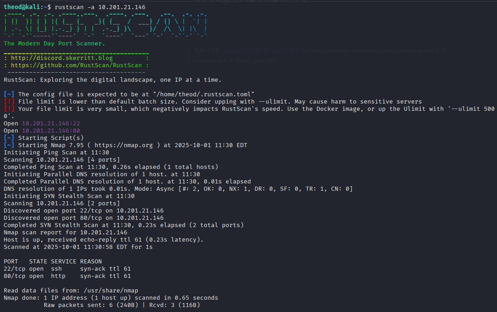
2.

theod@kali:~$ sudo gobuster dir -u http://10.201.21.146/ -w /usr/share/wordlists/dirbuster/directory-list-2.3-medium.txt 

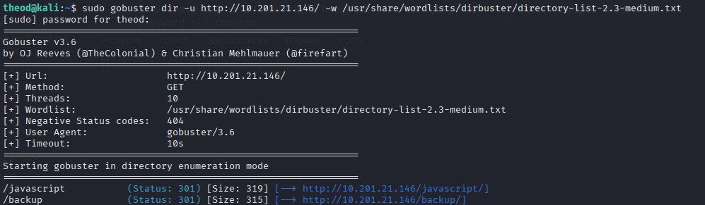

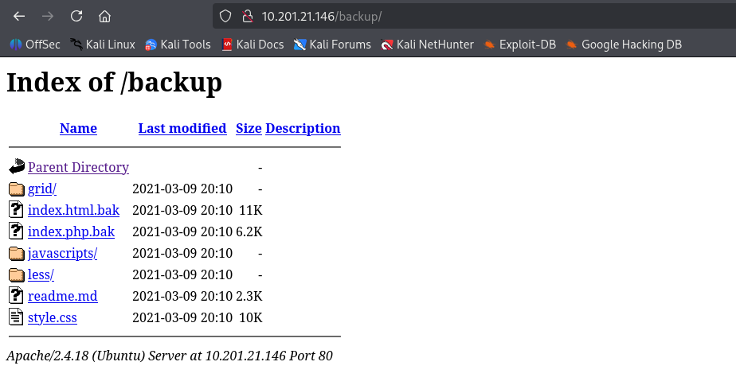

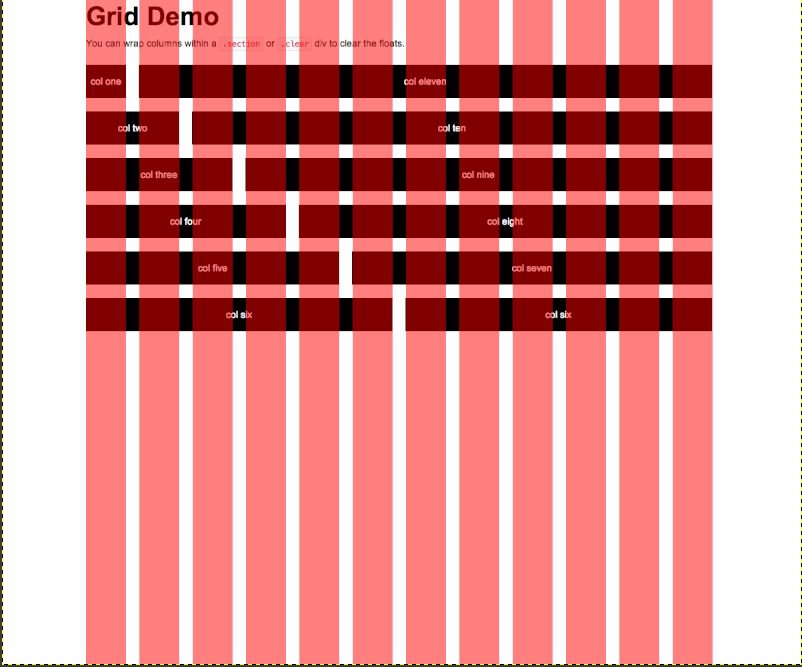

PHP хэсэг нь формоор ирсэн мэдээллийг сервер дээр message.txt файлын төгсгөлд бичиж хадгалах (лог/сэтгэгдэл хадгалах) зориулалттай: FormSubmit класс, SaveMessage() нь $_GET-ээс утгуудыг авдаг, __destruct() нь file_put_contents()-оор бичдэг.

message > bytes > store

store.evil > unserialize()> message
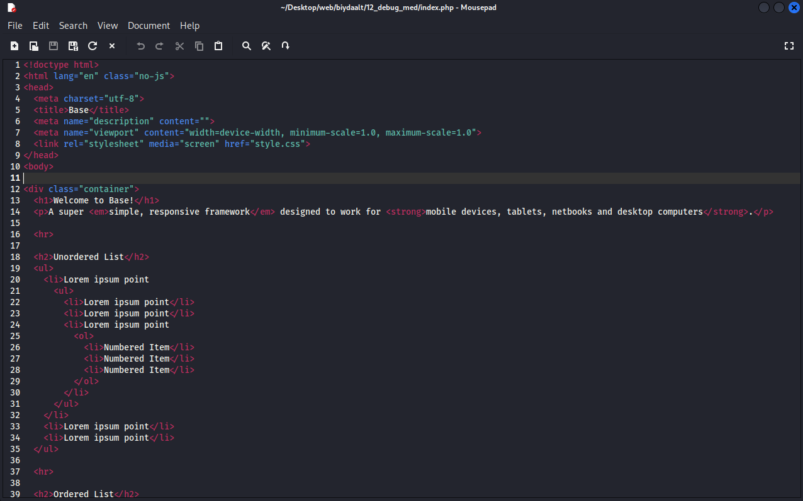

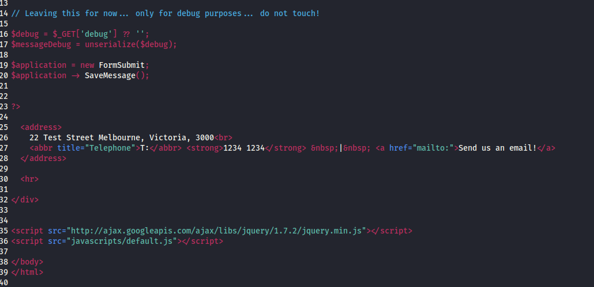

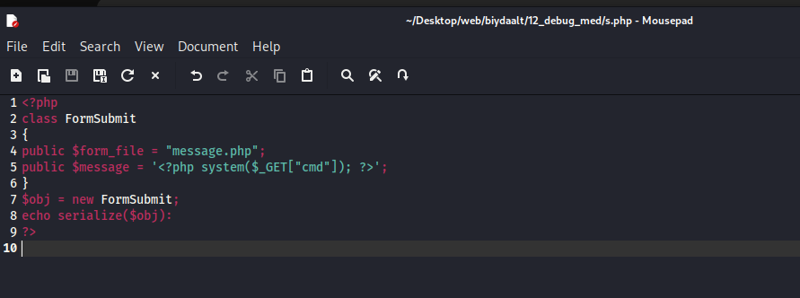

php code oo ajiluulad awsan formsubmit
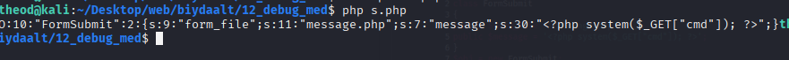

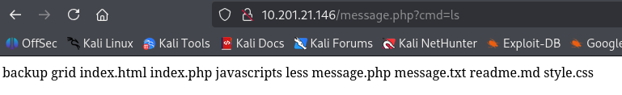

crackdaad jamaica geh password olson
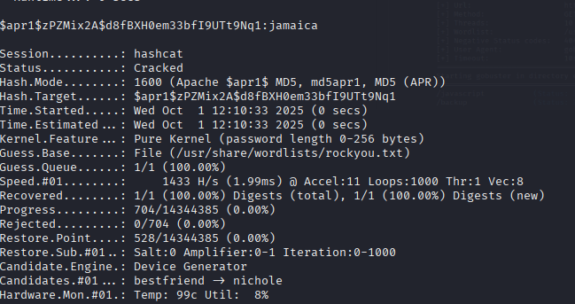

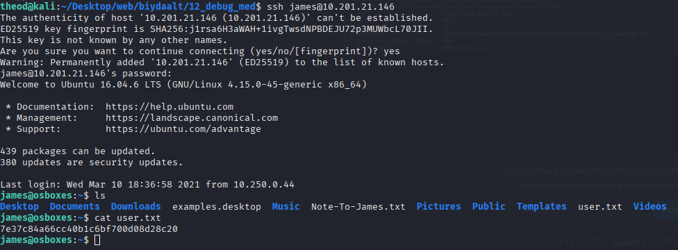

дээрх мөрийг 00-header файлын төгсгөлд нэмбэл, хэрвээ 00-header файлыг хэн нэгэн дараа гүйцэтгэвэл (эсвэл системийн эхлүүлэх/нийлүүлэх процесс тухайн 00-header-ийг унших байвал) тэр үед /home/james/bash гэж root-ээс үүсгэсэн setuid bash үүсч болох тул james хэрэглэгч түүнээр root эрхээр shell авах боломжтой болно. Энэ нь маш ноцтой privilege escalation (root болно) аюултай.
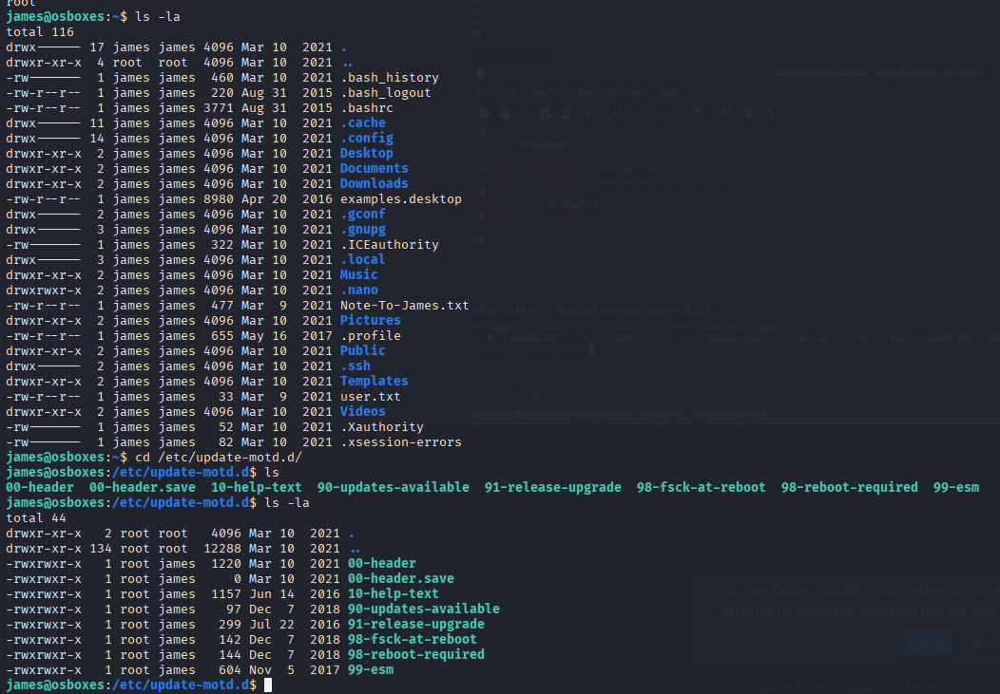

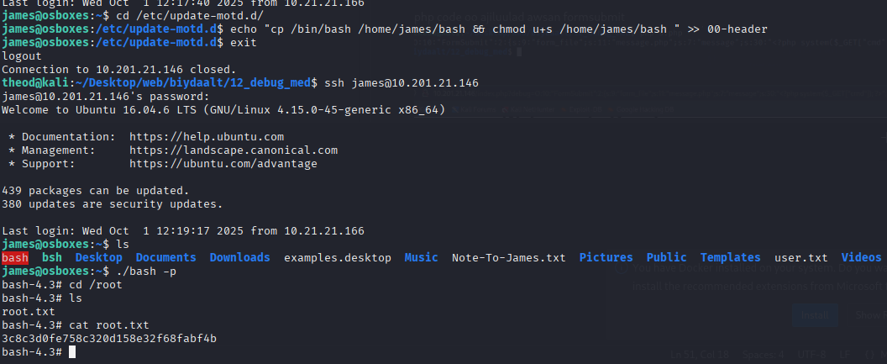

