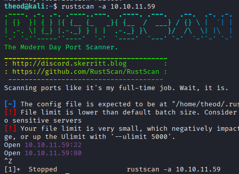
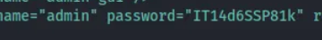
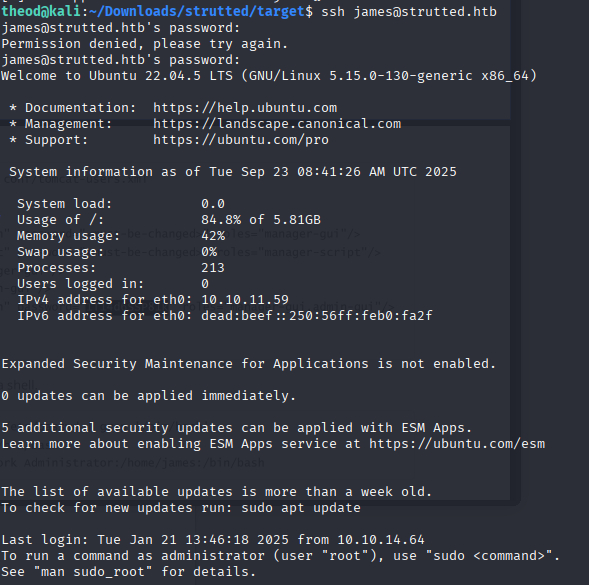
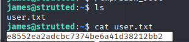
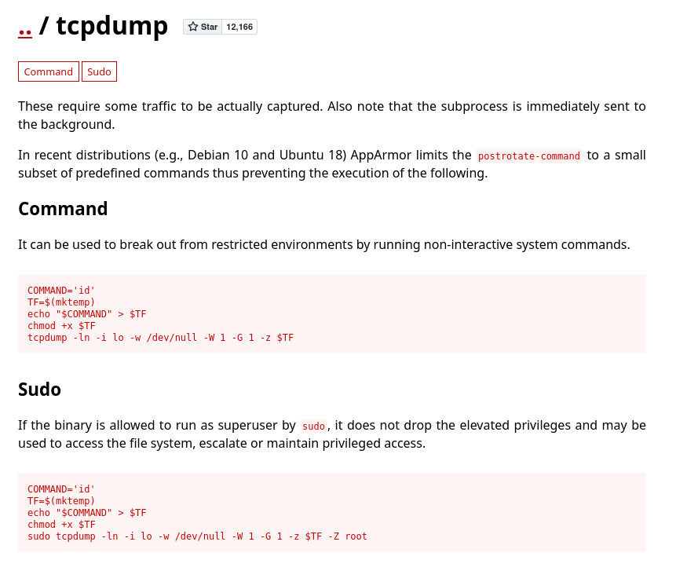
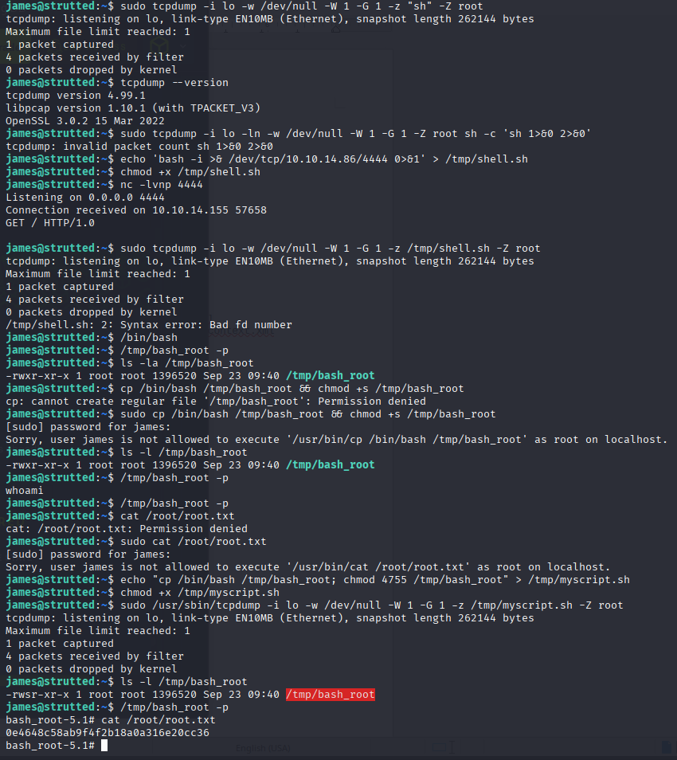

## How many open TCP ports are listening on Strutted?
- **2**

Tool: rustscan -a 10.10.11.59

RustScan, a very fast port scanner often used together with nmap -a means target

found:

Open 10.10.11.59:22

Open 10.10.11.59:80

## Clicking Download triggers a zip file download containing the Docker environment for the application, what is the name of the application server running on the target?
- **tomcat**

## In a Java project, what is the name of this file that contains the dependencies for the application?
- pom.xml
## What is the name of the MVC framework used by the application?
- Apache status
## What version of the framework does the application use?
- 6.3.0.1
## What is the 2024 CVE ID assigned to a vulnerability in the file upload logic vulnerability in Apache Struts?
- CVE-2024-53677

## What is the james user's password on Strutted?

- IT14d6SSP81k

## Submit the flag located in the james user's home directory.

## What commands can the james user run with elevated privileges using sudo?
- tcpdump

## Submit the flag located in the root user's home directory.

## sudo tcpdump -ln -i lo -w /dev/null -W 1 -G 1 -z "sh" -Z root

Энэ команда lo (loopback) интерфэйснээс пакетуудыг хянаж авна, бичлэгийг /dev/null руу бичиж устгана, 1 секунд тутам файл «эргэлт» (rotate) хийнэ, эргэлт болох бүрт sh командыг авчирсан файл дээр ажиллуулж оролдоно, ба tcpdump процесс нь root хэрэглэгч дээр бууна (өөрөөр хэлбэл эрх шилжүүлэхгүй — -Z root нь root-д л үлдээдэг).

-l
Stdout-ыг line-buffered болгож өгнө. Энэ нь tcpdump-ийн стандарт гаралт  шугамаар буцаж илүү түргэн харагдахад ашиглагддаг. 

-n
IP/порт нэрийг DNS-тээр эсвэл /etc/services-аар хөрвүүлэхгүй — сүлжээний хаяг/портуудыг тоон хэлбэрээр харуулна 

-i lo
lo буюу loopback интерфэйс (127.0.0.1) дээр сонсно. Үйлдэл нь тухайн машины өөртөө илгээж авсан траффик дээр ажиллана.

-w /dev/null
Барьж авсан пакетуудыг raw pcap файлаар бичнэ. Гэхдээ энд /dev/null гэж заасан тул бодитоор файлын руу бичигдэж хадгалагдахгүй — бүхэлдээ хаягдана. 

-G 1
Файл руу бичихийг тодорхой хугацаанд эргэлтэлнэ — энд 1 секунд тутам шинэ файл руу шилжих (rotate) болно. -G нь strftime-тай зэрлэг нэр ашиглах үед тохирдог 

-W 1
Эргэлт хийх үед хэдэн ширхэг файлыг ring buffer-аар хадгалах вэ гэдгийг заана. -W 1 бол хамгийн ихдээ 1 файл хадгална — утсаар тайлбарлавал шинэ файл үүсэхэд хуучин файл устгагдана.

-z "sh"
Файл эргэлт (rotate) болсон дараа tcpdump тухайн эргэлтэнд ашиглагдсан файлын нэрийг аргументаар дамжуулан заасан команд руу явуулна/давтална. Өөрөөр хэлбэл sh <rotated-filename> гэж дуудаж ажиллуулна. Ийм учраас хэрэв та -w-нд жинхэнэ файл зааж, тэнд шахагдсан/бичигдсэн агуулгыг attacker-controlled бол sh файл шиг гүйцэтгэх бололцоог үүсгэнэ — маш аюултай.

Т. Харин -z "sh" нь shell-ийг гүйцэтгэгч болгон ашиглаж байна.

-Z root
tcpdump program эхлээд root эрхээр эхэлсэн бол, пакетуудыг барьж авсны дараа энэ -Z сонголтоор өөр хэрэглэгчийн эрх рүү шилжиж болно. 

-Z root гэдэг нь root дээр хэвээр үлдэнэ — өөрөөр хэлбэл өдөр тутмын аюулгүй практикт бол -Z-г илүү бага эрхтэй хэрэглэгч (жишээ: nobody эсвэл tcpdump) болгож буулгах нь зөв. -Z root нь эрх шилжүүлэх эсвэ үл буулгах тохируулга учраас ховор хэрэгтэй.

## echo "cp /bin/bash /tmp/bash_root; chmod 4755 /tmp/bash_root" > /tmp/myscript.sh

→ /tmp/myscript.sh файл дотор cp /bin/bash /tmp/bash_root; chmod 4755 /tmp/bash_root гэж бичиж байгаа. Энэ скрипт нь /bin/bash-ийг /tmp/bash_root болгож хуулж, түүнд setuid root (4755) тохиргоог тавина.

4755 = 4 (special) + 7 (owner) + 5 (group) + 5 (others)

4 (special): setuid битийг асаана. (2 = setgid, 1 = sticky — эдгээрийг тусад нь адилхан тусгаад бичдэг.)

7 (owner): owner-д rwx (4+2+1)

5 (group): group-д r-x (4+0+1)

5 (others): others-д r-x

sudo /usr/sbin/tcpdump -i lo -w /dev/null -W 1 -G 1 -z /tmp/myscript.sh -Z root

-i lo (loopback), -w /dev/null (pcap-ыг /dev/null руу бичнэ), -G 1 (1 секунд тутам rotate), -W 1 (ring size 1), -z /tmp/myscript.sh (rotate болсны дараа энэ командыг дуудаж өг), -Z root (процесс root эрхтэй үлдэх). Tcpdump эхлээд packet барьж аваад rotation-г гүйцэтгэж, -z-ээр заасан скриптийг дуудах үед тухайн скрипт root эрхээр ажиллана (tcpdump-ийг sudo-оор эхлүүлсэн болохоор).

#Dugnelt 
trutted (HTB medium) машин дээр гол нь хоёр алддаг (vulnerable) зvйл байв; товчлуулбал — вэб дээрх удалгүй код гүйцэтгэх (RCE) болон дотоод эрх шилжих (privilege escalation). Тодруулбал:

Анхны эвдрэл — вэб/фреймворкийн RCE
Вэб аппликейшнд Apache Struts-тэй холбоотой эмзэг (OGNL injection/Struts RCE) ашиглагдан, удахгүй www-data/вэб хэрэглэгчийн эрх дээр команд гүйцэтгэж shell авч орсон. (Энэ бол эхний foothold — вэб сервер дээр командаар ажиллах боломж олгоно.)

PrivEsc — tcpdump -z / root-ээр скрипт гүйцэтгэх
Дотоод судалгаагаар root эрхтэй ажиллаж байсан tcpdump-ын -z функц (rotate болсны дараа заасан команд дуудах) ашиглагдаж, attacker-controlled скриптийг root эрхээр ажиллуулсан. Энэ скрипт /bin/bash-ийн хуулбарыг /tmp-рүү хуулж түүнд setuid root тохиргоо өгч (chmod 4755), ингэснээр /tmp/bash_root-г ажиллуулж root shell авч чадсан — цэвэр, шууд privilege escalation.

Эдгээрийн нийлбэр нь — вэб дэлгэцийн RCE → локал эрх нэвтрэх → root-д tcpdump-ийн -z механизмаар скрипт гүйцэтгэж setuid bash үүсгэх → root shell.

Ямар засвар/савлагаа хийх вэ (remediation)

Apache Struts болон бусад вэб фреймворкийг шинэчлэх (патч суулгах).

tcpdump-ийг root-ээр үргэлж ажиллуулж болохгүй; -Z сонголтоор багатай эрхтэй хэрэглэгч дээр уншуулах, -z-д arbitrary shell скрипт зааж болохгүй болгох.

sudo болон root-ээр ажиллаж болох програмуудын ашиглалтын аудит хийх; /tmp-д setuid файл үүсэхийг хяналт тавих.

AppArmor/SELinux зэрэг confinement хэрэгслээр tcpdump ба вэб үйлдлийг хязгаарлах.