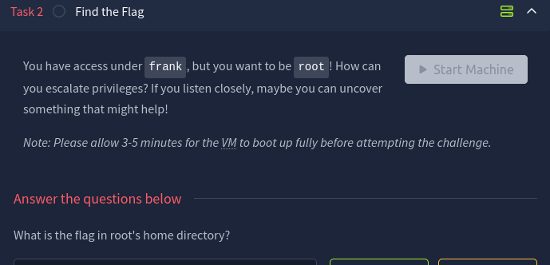
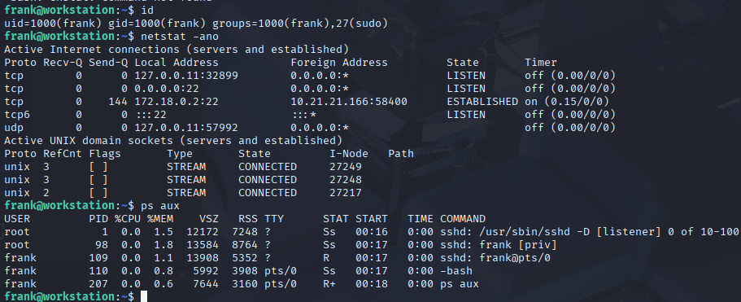
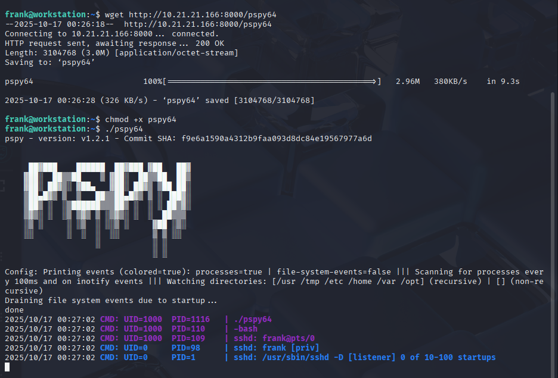
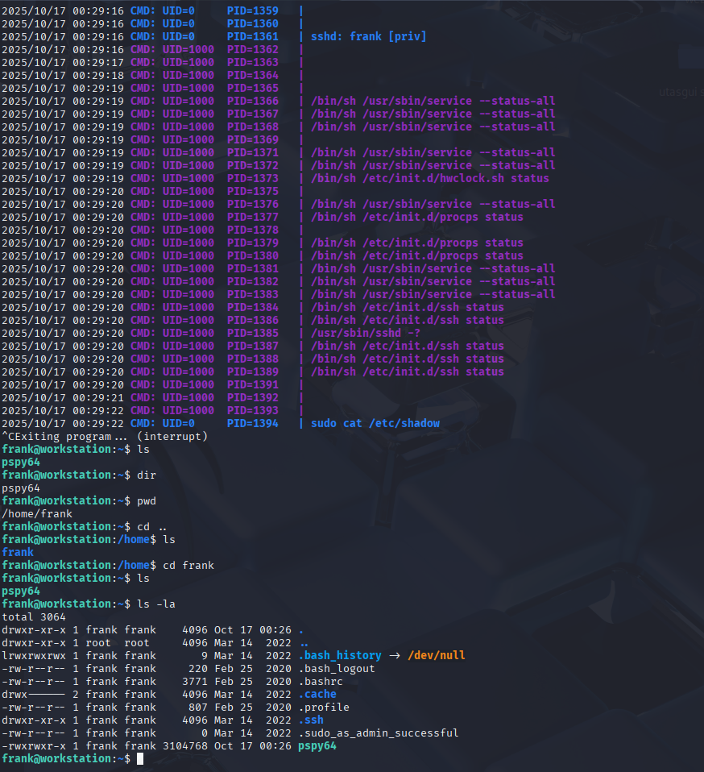
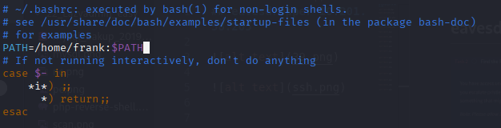
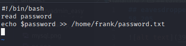
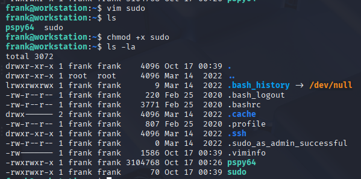
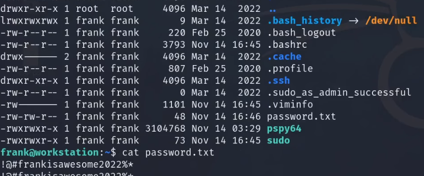
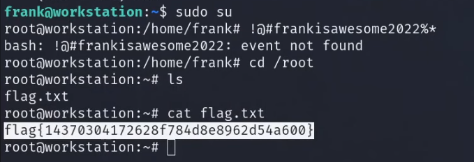

## eavesdropper 10.201.58.205

pspy64 бол privilege escalation хийх үед систем дээр ямар процессууд автоматаар ажиллаж байгаа, юуг cron эсвэл root ажиллуулж байна гэдгийг хянах зорилготой хэрэгсэл юм.

bashrc filed bichsen

vim ashiglan sudod bichsen

