1. 3 port ajillaj bga
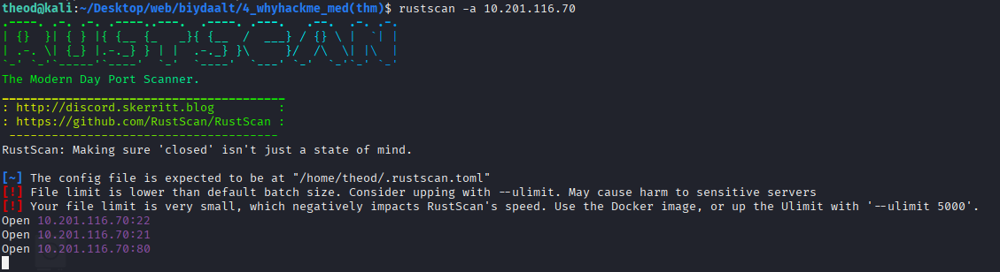

2. ftp geer orood update.txt file olson

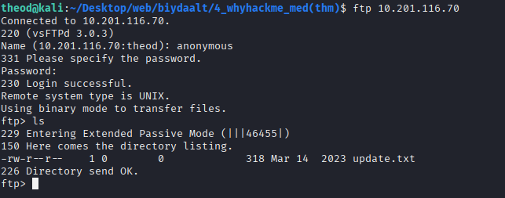

3. file dotorh text
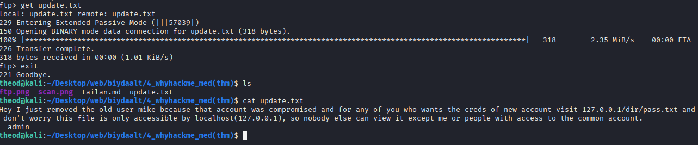

4. gobuster dir -w /usr/share/wordlists/dirbuster/directory-list-2.3-medium.txt -u http://10.201.116.70

5. 

6. web ruu orhod end darj newternuu gsn link bsn teren deer darj orhod login page garj irhed url deer login.php g register bolgon solij register page ruu oron injection hiij burtguulsen
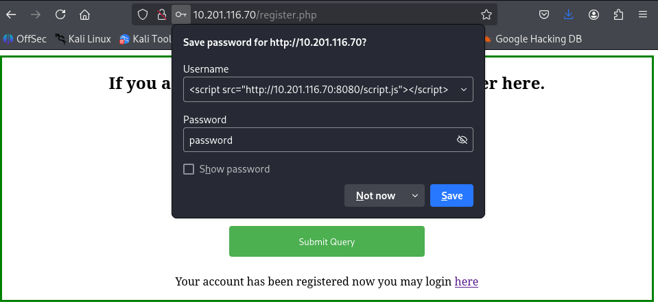

7. 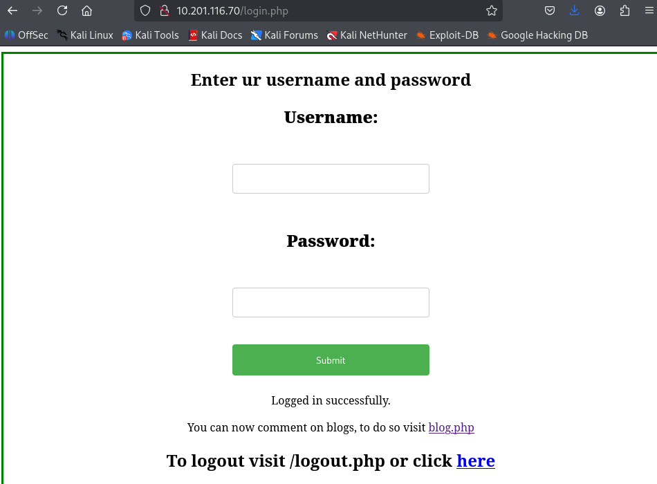

8.   last query that worked

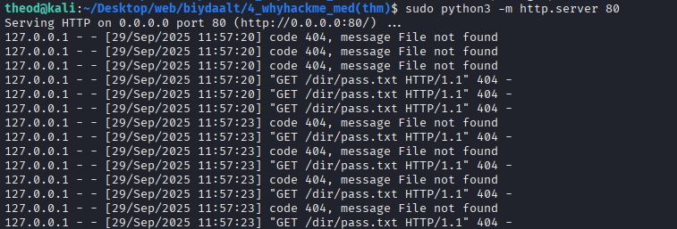
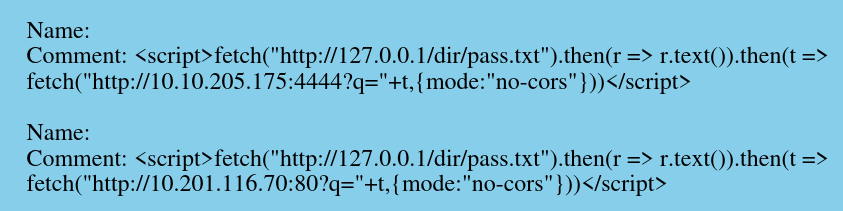
9.

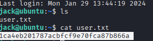

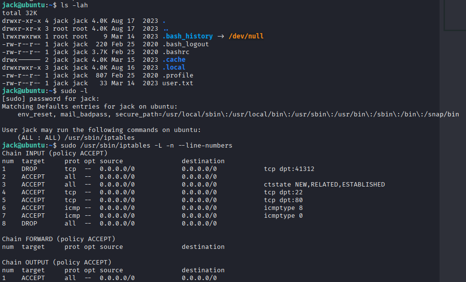

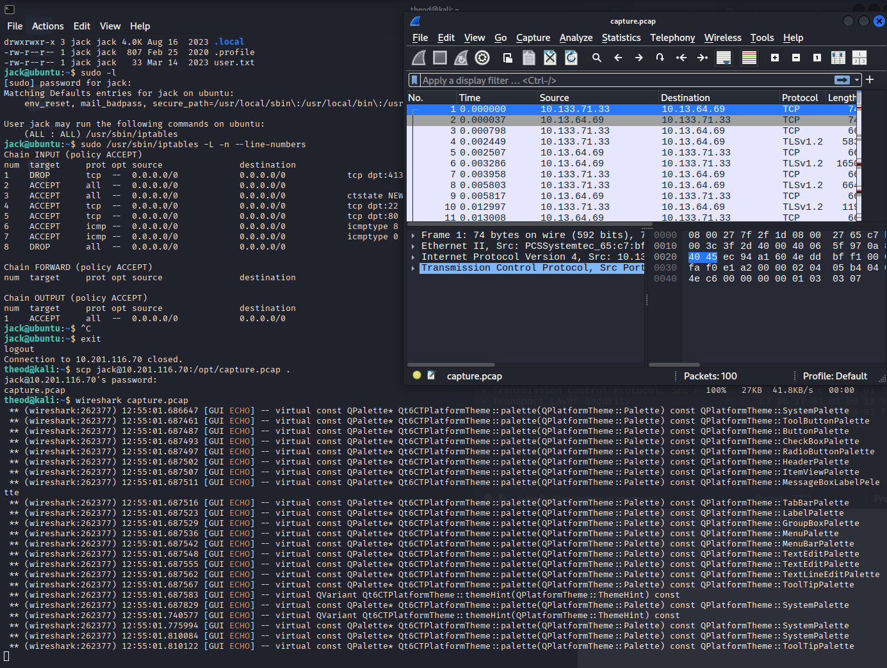

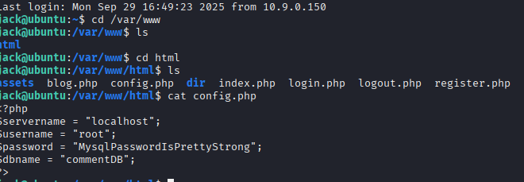

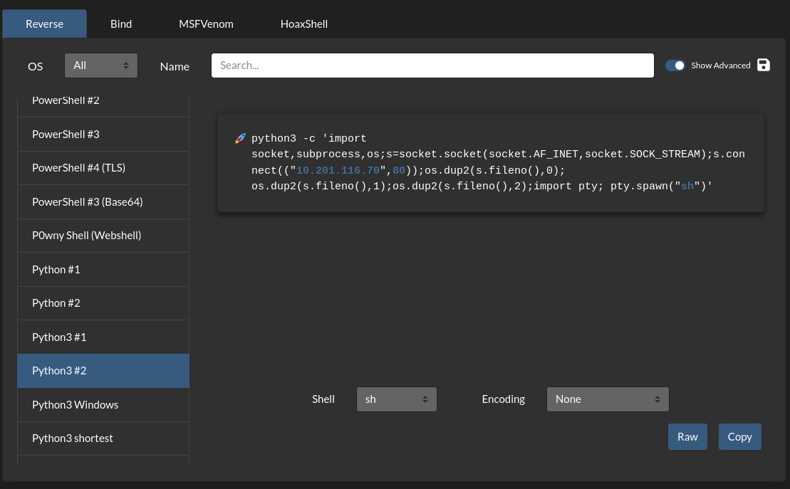

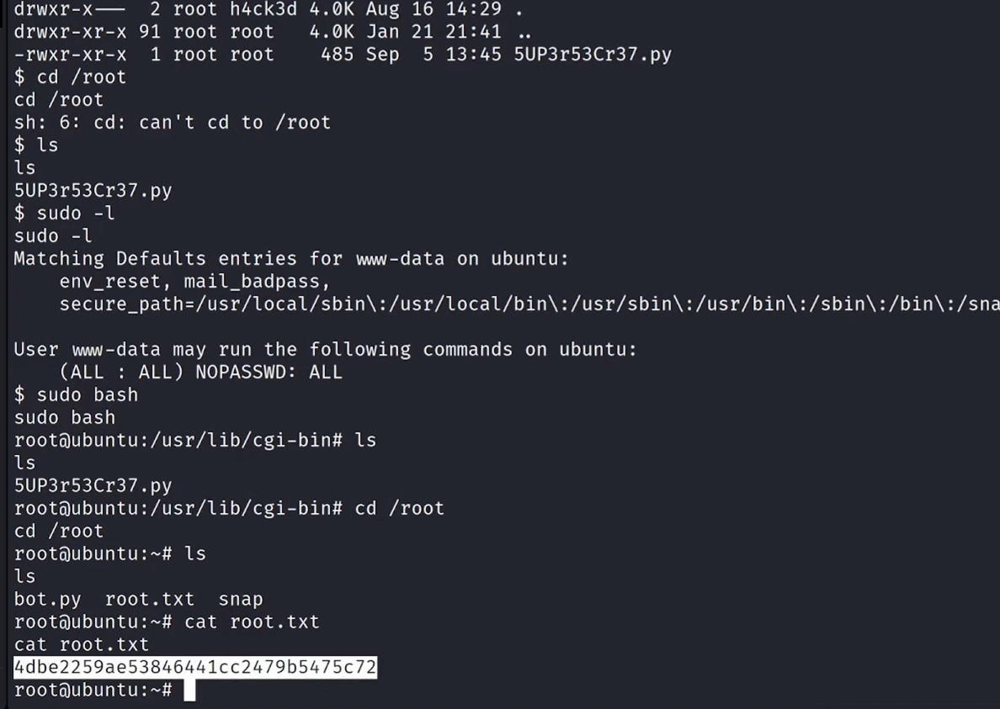

