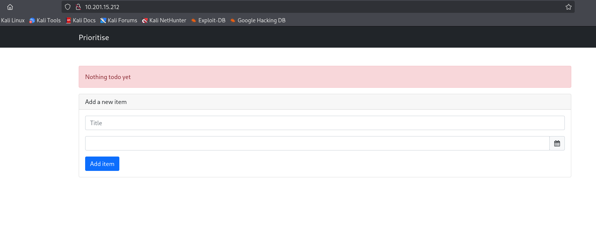
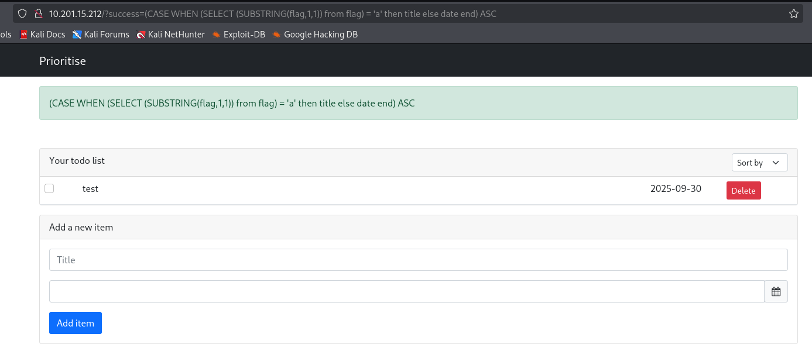
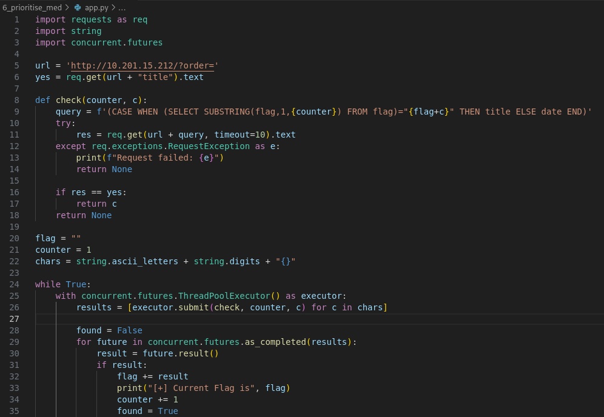
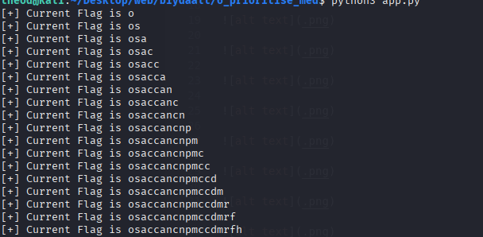
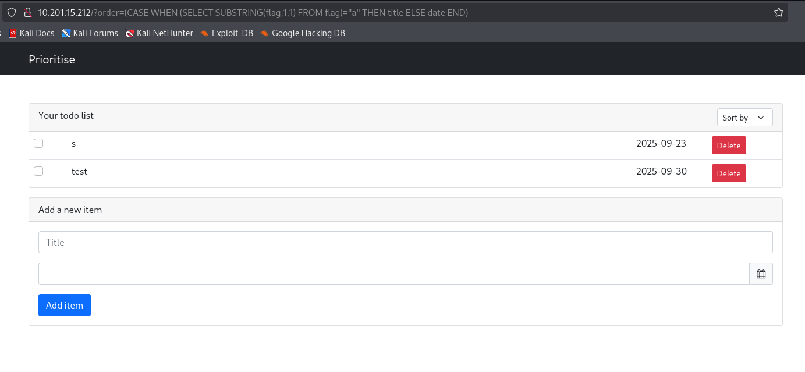
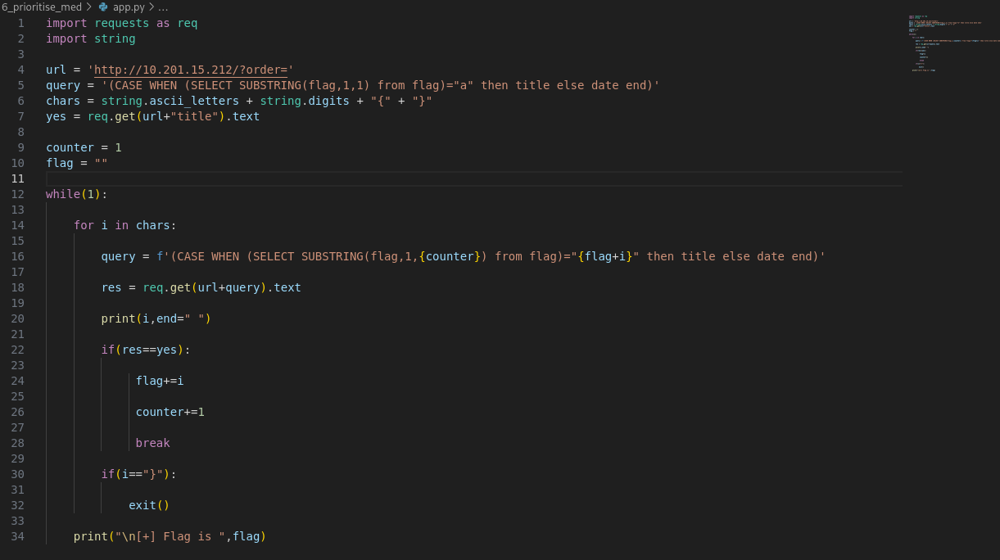
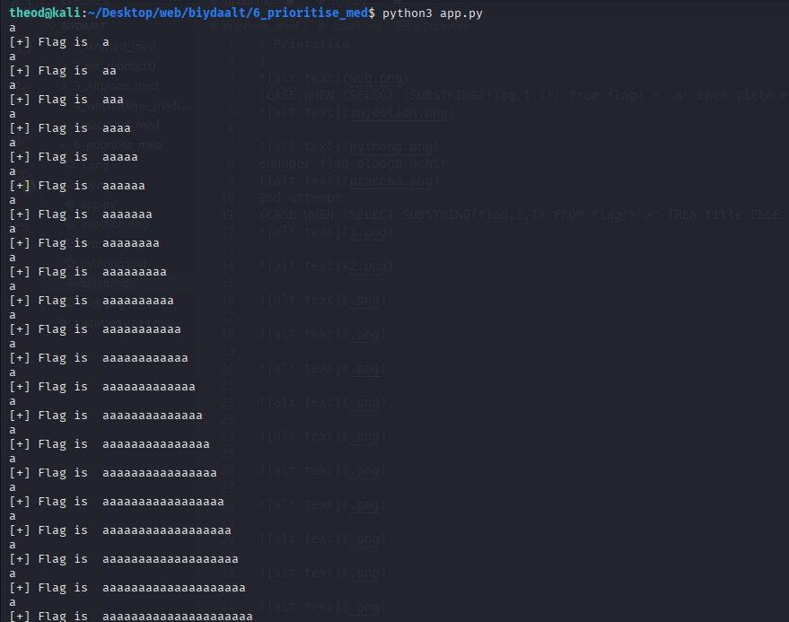

# Prioritise
1. 

(CASE WHEN (SELECT (SUBSTRING(flag,1,1)) from flag) = 'a' then title else date end) ASC

enuuger flag oloogu uchir 

2nd attempt 
(CASE WHEN (SELECT SUBSTRING(flag,1,1) FROM flag)="a" THEN title ELSE date END)

